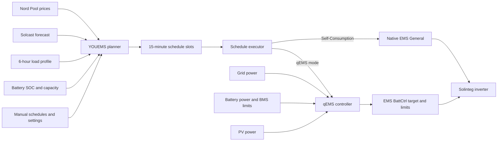

<!-- SPDX-License-Identifier: Apache-2.0 -->
<!-- Copyright 2026 Rickard Dahlstedt -->

# YOUEMS

**YOUEMS** is a Home Assistant energy-management system for a Solinteg hybrid inverter and battery. It combines Nord Pool electricity prices, Solcast PV forecasts, measured household consumption, battery state, and inverter feedback to create and execute a rolling 15-minute energy schedule.

The project has two main parts:

- **Planner:** decides when to charge, discharge, preserve the battery, export solar, or use normal self-consumption.
- **qEMS controller:** implements inverter behavior through Solinteg's `EMS BattCtrl` registers with fast external feedback from Home Assistant.

> [!WARNING]
> YOUEMS writes operating-mode and EMS control registers in a grid-connected inverter. It is built and tested for one specific Solinteg installation and is **not a universal drop-in package**. Verify every entity ID, register-backed control, power sign, battery limit, and grid rule before enabling real inverter writes. Begin with **Dry Run**.

## Current reference version

This README describes:

- Scheduler: `v2026.08.25.11.14`
- Dashboard: `v2026.08.22.20.18`

The tested system uses:

- Solinteg MHT-10K-25 inverter
- Pylontech Force H3 battery, 20.4 kWh
- 9.7 kWp PV
- Home Assistant
- Solax Modbus integration with Solinteg definitions
- Nord Pool SE3 prices
- Solcast PV forecasts
- Unagi SE3 electricity-price forecast for dashboard preview only

### Safe rollback baseline

The user explicitly selected this pair as the current last-safe rollback/regression baseline on 2026-08-18:

- Scheduler: `v2026.08.17.13.12`
- Dashboard: `v2026.08.18.13.40`

Keep those files available when diagnosing later planner or dashboard regressions.

## What YOUEMS does

YOUEMS can:

- Build a schedule across today and tomorrow in 15-minute periods.
- Replan automatically every 15 minutes.
- Generate a schedule manually from a separate set of planner settings.
- Charge the battery during economically useful low-price periods.
- Preserve stored energy for expensive periods.
- Export selected morning solar when the price is favorable.
- Sell battery energy only when forecast solar is expected to refill it.
- Capture PV into the battery when future energy coverage is insufficient.
- Hold the battery completely idle during selected no-solar periods.
- Avoid rapid mode flickering by consolidating nearby schedule periods.
- Keep manual schedules protected while rebuilding automatic schedules.
- Preview plans and inverter actions with Dry Run.
- Display prices, forecast SOC, PV, schedules, status, savings, and planner diagnostics in a Lovelace dashboard.
- Preview Unagi hourly next-day price estimates in Plotly whenever actual Nord Pool tomorrow prices are not yet available; Unagi is display-only and does not feed the planner.

## System architecture



The planner performs the relatively heavy forecasting and optimization only during a replan. The qEMS controller is a small one-second feedback loop responsible for live inverter control between replans.

## Operating modes

### Native mode

| Mode | Implementation | Behavior |
|---|---|---|
| **Self-Consumption** | Inverter `EMS General` | The inverter handles normal self-consumption internally: PV supplies the house, surplus PV charges the battery, and the battery can supply the house when required. |

Self-Consumption intentionally does **not** use the external qEMS feedback loop. Native inverter control is preferred when ordinary self-consumption is the desired behavior.

### qEMS modes

All qEMS modes use `EMS BattCtrl`. Home Assistant calculates or maintains the battery-power target and applies mode-specific EMS import/export limits.

| Mode | Intended behavior |
|---|---|
| **qEMS Feed-In** | Exports available PV while preventing grid import. If PV is below household demand, the battery may cover the deficit. |
| **qEMS Self-Consumption** | External zero-grid-style self-consumption. The battery target is continuously adjusted to balance household demand after PV. |
| **qEMS PV Charge** | Sends available PV toward battery charging first. Inverter AC input is blocked for battery charging, but **this is not a site-level no-import mode**: the house may still import from the grid while PV is reserved for the battery. |
| **qEMS PV Charge+House** | PV supplies the house first and only remaining PV charges the battery. Battery discharge is prevented and grid charging of the battery is blocked. This is normally preferable when the goal is to avoid importing house load merely to prioritize battery charging. |
| **qEMS Battery Charge** | Charges at least the requested battery power, but automatically increases charging to absorb a larger PV surplus instead of exporting it. Grid charging is allowed for the requested shortfall. |
| **qEMS Battery Discharge** | Discharges at least the requested power while also covering higher household demand when needed. |
| **qEMS Battery Freeze** | Requests zero battery power and blocks inverter AC **input** while leaving inverter AC output open. PV therefore remains free to supply the house/export while the battery is held at zero. The qEMS Export Negative Price Guard may independently restrict output when active. |

All seven qEMS modes have been tested on the reference installation.

## How the qEMS controller works

The qEMS controller runs once per second by default. It reads:

- Grid power
- Battery power
- PV power for diagnostics
- BMS maximum charging current
- BMS maximum discharging current
- Current BattCtrl target
- Current EMS inverter AC import/output limits

The controller then calculates a safe battery target for the active mode.

### Sign conventions

The current configuration assumes:

- Inverter grid meter: **positive = export**, **negative = import**
- Battery power: **positive = discharge**, **negative = charge**
- BattCtrl target: **positive = discharge**, **negative = charge**

These signs must be verified on every installation.

### Default qEMS tuning

The tested defaults are applied once on a new installation and then persist across Home Assistant restarts:

| Setting | Default |
|---|---:|
| Controller interval | 1 s |
| Post-write settling | 2 s |
| Grid deadband | 0.01 kW |
| Minimum target change | 0.01 kW |
| Maximum target step | 2 kW |
| Maximum target | 10 kW |

Battery Charge and Battery Discharge selected manually from the Inverter card begin at **0 kW**. For Battery Charge, 0 kW is now a **minimum** rather than a fixed zero: available PV surplus may still charge the battery.

### Battery Charge PV-surplus capture

`qEMS Battery Charge` treats the requested power as a **minimum battery-charge magnitude**, symmetrical in spirit with Battery Discharge treating its requested power as a minimum discharge magnitude.

Let `D = house load - PV = battery - grid`, where negative `D` means PV surplus, and let `R` be the requested positive charge magnitude. The controller uses:

```text
target = min(-R, D)
```

Equivalently, the battery charge magnitude is `max(R, PV surplus)`, bounded by qEMS Maximum Target and by the inverter/BMS.

Examples:

- Request 4 kW, PV surplus 1 kW → battery target ≈ -4 kW; grid supplies the remaining ≈3 kW.
- Request 4 kW, PV surplus 6 kW → battery target ≈ -6 kW; the extra PV is absorbed rather than exported.
- Request 0 kW, PV surplus 6 kW → battery target ≈ -6 kW; no grid battery charging is requested, but free PV is still captured.
- If PV surplus exceeds the configured qEMS maximum target or BMS acceptance, the unavoidable excess may still export.

This mode therefore requires fresh grid and battery feedback. The PV sensor itself remains diagnostic because `battery - grid` already yields demand after PV.

### Mode activation order

When entering `EMS BattCtrl`, YOUEMS always changes the inverter working mode first. Only after Home Assistant confirms `EMS BattCtrl` does it write:

1. PV priority
2. Maximum inverter AC output (register 50208; often labelled "Max Grid Export" by integrations)
3. Maximum inverter AC input (register 50209; often labelled "Max Grid Import" by integrations)
4. Initial BattCtrl target

This order matters because BattCtrl parameters written before the working-mode change may be stored/read back but still not be enforced by the inverter. **Register readback is therefore not proof that a pre-mode write took effect.** YOUEMS always enters and confirms `EMS BattCtrl` first, then writes the complete priority/limit/target set.

When qEMS is not active, working-mode changes normally reassert unrestricted EMS AC limits so restrictive settings left by a previous qEMS profile are not carried into another inverter mode. The one deliberate exception is the **negative-price export guard**: while it is active, the managed 50208 output cap is retained even in native `EMS General`. The inverter's actual working mode remains authoritative: if it is changed externally while a schedule is already running, qEMS stops rather than fighting the external change.

When the requested qEMS sub-mode is already active, YOUEMS preserves the live target and performs no initialization writes. This prevents a schedule boundary from momentarily resetting a battery that is charging or discharging at high power.

### Controller safety

- The BMS charging and discharging permissions gate target direction.
- Stale or invalid feedback pauses control and moves the target toward a safe value.
- Large target changes can be limited by Maximum Target Step.
- Grid noise inside the deadband is treated as zero.
- The fast loop writes only when the target change passes the configured threshold, except for urgent safety correction.
- Battery Charge is feedback-driven: its target may rise above the requested minimum when measured PV surplus is larger.
- If the inverter leaves `EMS BattCtrl`, the qEMS controller stops and clears its remembered sub-mode without forcing the inverter back.
- A remembered qEMS sub-mode is considered valid only while the inverter is actually in `EMS BattCtrl`.
- No battery charge-current or discharge-current registers are changed by YOUEMS.

### qEMS Battery Freeze output semantics

Testing on the reference installation confirmed that Battery Freeze does **not** need a zero inverter-output limit to hold the battery still. The current profile therefore uses:

```text
BattCtrl target (50207) = 0 kW
Max inverter AC input (50209) = 0 kW
Max inverter AC output (50208) = open / 200 kW
```

This keeps measured battery power at approximately zero while allowing available PV to serve the house and export normally. If qEMS Export Negative Price Guard is active at the same time, that separate controller may dynamically reduce 50208.

This distinction is useful for PV-availability learning because Battery Freeze by itself is no longer an artificial PV-curtailment condition.

## qEMS Export Negative Price Guard

The optional **qEMS Export Negative Price Guard** prevents unwanted PV export whenever the fee-inclusive Nord Pool **sell price is negative**. It no longer uses configurable Öre thresholds or an export-confirmation timer:

```text
Guard enabled + sell price < 0   -> Active immediately
Guard enabled + sell price >= 0  -> Armed/released immediately
```

Current site export is deliberately **not** a prerequisite. The guard is applied as soon as the sell price becomes negative, so it can prevent the first costly export rather than waiting until export has already been observed. Plotly uses the exact same `< 0` sell-price rule for its red negative-price bars.

The guard no longer uses the inverter's persistent `Export Limit` switch/percentage during normal operation. Those legacy settings are treated as EEPROM-style configuration and are intentionally removed from the fast control path.

Instead, YOUEMS uses EMS register **50208**, the observed **Maximum Inverter AC Output** control. The user configures only the allowed site-export buffer as a percentage; on the reference MHT-10K-25 installation, `10% = 1.0 kW` allowed site export and `0% = 0.0 kW`.

A crucial distinction is that 50208 does **not** directly represent utility-meter/site export. It limits the inverter's own positive AC output. Therefore YOUEMS calculates:

```text
house load = PV + battery - grid
dynamic 50208 cap = house load + allowed site export
```

where native Solinteg grid sign is positive export and battery sign is positive discharge / negative charge.

Battery charging is **not added again** to the limit. When the battery is charging, negative battery power already reduces inverter AC output; adding charge power separately would allow too much grid export. Example: PV 8 kW, battery charging 5 kW, site exporting 1 kW implies house load 2 kW. With a 1 kW export buffer, the correct inverter-output cap is `2 + 1 = 3 kW`, not 8 kW.

The dynamic controller:

- runs against 50208 while the inverter is in either **EMS General** or **EMS BattCtrl**;
- never changes Working Mode just to limit export;
- coexists with qEMS Battery Freeze: Freeze holds battery target and inverter AC input at 0, while the negative-price guard independently owns any required 50208 output restriction;
- reuses the existing qEMS **Controller Interval**, **Post-Write Settling**, **Grid Deadband**, and **Minimum Target Change** settings;
- uses the same qEMS sensor-freshness philosophy and holds the existing cap while required PV/battery/grid feedback is stale;
- keeps a separate `qems_last_output_limit_write` timestamp so 50208 settling cannot starve the independent 50207 battery-target loop, and vice versa;
- deliberately does **not** use qEMS Maximum Target Step for 50208: export tightening and house-load headroom should respond promptly;
- releases back to the normal qEMS output limit immediately when the sell price is no longer negative or the feature is disabled;
- respects Dry Run.

The reference installation has verified that 50208 is enforced in `EMS General`, which allows native Self-Consumption to continue while YOUEMS trims inverter output.

### Expected inverter status indications while limiting

While the guard is actively restricting inverter output, the inverter may report **`EMS CmdLim`**, **`PV PLim`**, or both. This is expected behavior rather than a fault:

- **EMS CmdLim** indicates that the requested inverter power is being constrained by an EMS limit.
- **PV PLim** indicates that PV production is being curtailed because the permitted inverter output has been reached.

These indications may appear especially when available PV exceeds `house load + allowed export`, because 50208 is intentionally forcing the inverter/MPPT system to reduce positive AC output.

The native/persistent inverter **Export Limit** feature is outside YOUEMS control and must be left **Off** when commissioning this controller. Current YOUEMS neither reads nor writes that EEPROM-style Export Limit switch/percentage; negative-price limiting is handled entirely through runtime EMS register 50208.

## Sell replan boundary consistency

The rolling Sell energy budget starts from the planner's already-projected **next 15-minute boundary SOC**. Sell gap/load simulation therefore begins at that exact quarter-hour.

Earlier code projected SOC to the next quarter-hour, then started the Sell gap simulation at the next **30-minute** boundary because Solcast is 30-minute data. If the planner boundary was `:15` or `:45`, one 15-minute interval was silently omitted. This could make a marginal Sell slot disappear on a `:29`/`:59` automatic replan and reappear on a manual run just after `:30`/`:00`.

Current behavior walks the Sell gap in **15-minute steps from `planner_next_slot_ts`**, using the enclosing 30-minute Solcast period's average kW for each half. The no-refill ten-hour reserve likewise uses 40×15-minute steps from the planner boundary. The later refill simulation remains 30-minute aligned.

Late Sell anchors are intentionally preserved when current household use temporarily reduces the Sell energy budget; pending records outside the current allocation count remain stored until their destination passes.

## BMS discharge-permission planning guard

YOUEMS allows the configured **Planner Minimum SOC** to be below the Force H3's nominal 10% BMS SOC floor because Operational Shadow SOC and BMS SOC are independent estimates and can differ by several percentage points. Therefore the planner does **not** impose a permanent 10% sSOC minimum.

At every (re)plan, YOUEMS reads `sensor.solax_inverter_battery_discharge_limit`. The existing qEMS runtime already refuses positive battery targets when this BMS current permission is near zero. The planner now uses the same signal:

- discharge limit `> 0.05 A` -> normal planning with the user's selected minimum SOC;
- discharge limit `<= 0.05 A` -> BMS discharge guard is active.

While guarded, the Force/BMS 10% floor is translated into the current Operational Shadow SOC coordinate system:

```text
mapped sSOC floor = current Operational sSOC + (10% - current BMS SOC)
```

The temporary physical floor is the greater of that mapped floor and the **current sSOC**. The latter matters if the BMS has blocked discharge for some reason other than low SOC: the planner must not assume immediate battery use merely because the mapped 10% floor happens to be lower.

The effective automatic-planner floor is then:

```text
effective planner floor = max(user Planner Minimum SOC, mapped BMS discharge floor)
```

This means a system at, for example, BMS SOC 10% / Operational sSOC 7% with zero discharge permission can still keep a 7% user setting. It simply plans **no further discharge at 7%**. Solar or grid charging may lift projected sSOC above that floor; later battery use can then be scheduled back down to the floor. On a subsequent real replan, the live BMS discharge-limit signal remains authoritative.

The guard is applied to the automatic Self-Consumption/dispatch reserve, Sell planning, Feed-In safety, and the currently-running-slot SOC projection. Protected manual slots remain user-owned; actual qEMS battery targets are still independently blocked by the runtime BMS permission guard.

Planner notifications show the live BMS discharge limit, BMS SOC, mapped sSOC floor, and any temporary effective planner floor.

### Charge Loss cycle-contamination guard and rejected-attempt diagnostics

Charge Loss learning now treats any declared inverter/Modbus communication fault during
a full-to-full interval as contamination of that entire learning cycle.

- `input_boolean.youems_shadow_charge_loss_cycle_contaminated` is latched when the
  system communication watchdog declares a fault.
- The latch deliberately survives communication recovery and HA restart.
- At the next automatic `FULL LIMIT` anchor, the cycle is categorically rejected for
  Charge Loss learning even if its final Q/D ratio happens to look plausible.
- The new healthy anchor then clears the latch and starts a clean cycle.
- A healthy manual anchor also starts a new clean interval and clears the latch.
- `input_text.youems_shadow_charge_loss_last_attempt` records **every automatic full**
  attempt, accepted or rejected, before the fine Q/D counters are reset.
- The diagnostic includes previous anchor type/SOC, Q, D, observed loss and a concrete
  rejection reason (communication contamination, untrusted previous anchor, shallow
  cycle, observed loss below 0%, or observed loss above 5%).
- `sensor.youems_charge_loss` exposes `last_attempt` and `cycle_contaminated` attributes.
- `input_text.youems_shadow_charge_loss_last_update` remains the last **accepted**
  learning event only.

This avoids learning from a cycle that crossed an inverter/Modbus outage and makes a
rejected full-to-full closure auditable instead of silently leaving the sample count
unchanged.

## Shadow SOC restart / inverter-communications resilience

When stitched Force H3 fine-counter tracking is initialized, the Solinteg lifetime charge/discharge totals are **diagnostic only**. A temporary inverter-communications failure can briefly expose a numeric zero or stale lower lifetime total. That must not be interpreted as a physical counter reset and must not invalidate Shadow SOC.

Current behavior:

- while `input_boolean.youems_shadow_fine_counter_initialized` is ON, lower Solinteg lifetime totals are ignored for Shadow validity;
- coarse lifetime-counter reset handling is used only when fine tracking is unavailable and the system is already operating in coarse fallback mode.

This permanently prevents the false-reset failure seen after a transient Modbus/inverter dropout followed by a Home Assistant restart. No special one-time recovery path remains in normal code.

## Shadow SOC estimator

YOUEMS keeps two Shadow SOC values. **Raw Shadow SOC** (`sensor.youems_shadow_battery_soc`) is deliberately unbounded and remains a diagnostic/calibration value: it may go below 0% or above 100% so accumulated measurement error remains visible. **Operational Shadow SOC** (`sensor.youems_operational_shadow_soc`) is the physically guarded 0–100% value used by the planner and by charge-acceptance bucket selection.

The estimator is anchored automatically only at a verified full-charge endpoint. During a continuous charge it arms when either SOC source reaches the high-SOC region (>=95%) while charge direction and BMS charge permission still indicate charging; a one-minute watchdog provides the same recovery if the exact crossing event is missed. When BMS maximum charge current subsequently transitions to zero after measurable charge movement, the endpoint is anchored as exactly 100%. There is deliberately no automatic low-SOC anchor. Manual re-sync controls remain available for diagnostics and recovery.

**Charge Loss** is now an automatically learned physical battery parameter. The internal persisted estimate remains bounded to **0–5%**, but is stored at **0.001% resolution** and is no longer exposed as an editable dashboard slider. The read-only `sensor.youems_charge_loss` is the common value used by Shadow SOC, planner physical SOC, and Plotly pSOC.

Before YOUEMS has one qualified learning cycle, the sensor deliberately reports **2.500%**. No `initial:` value is forced into the persisted helper; the 2.5% value is a fallback until automatic learning has trustworthy data.

The physical rule remains:

```text
stored charge = measured/accepted charge × (1 - Charge Loss / 100)
```

Learning occurs only at an **automatic verified BMS full-charge endpoint** when the previous Shadow anchor was also a reliable full anchor. For a full-to-full interval, Shadow SOC treats discharge energy as exact and solves the observed charge-side loss from the stitched counters:

```text
observed Charge Loss = 100 × (1 - discharged kWh / charged kWh)
```

This intentionally does **not** use the BMS remaining-capacity change between the two full anchors, so BMS capacity recalibration is kept separate from charge-loss learning. Shallow top-ups are rejected: the cycle must contain at least 20% of the previous full-anchor energy in measured charge, with a 2.0 kWh absolute minimum, and the resulting observation must lie inside 0–5%.

The learner is a throughput-weighted running average rather than an exact replacement. The 2.5% fallback begins with an effective 10 kWh prior weight; each qualified cycle contributes up to 20 kWh; long-term history is capped at an effective 50 kWh so the estimate remains stable but can still adapt. For example, a first 10 kWh cycle observing 2.600% moves the learned value only to 2.550%, not directly to 2.600%.

Charge Loss remains independent of the planner's **Cycle Efficiency** economic assumption. Accepted charging energy is reduced by Charge Loss before it advances stored SOC; discharge energy remains unchanged everywhere.

To avoid hiding calibration error, raw Shadow SOC is never clamped. If raw Shadow SOC is above 100% when genuine discharge begins, YOUEMS latches the excess above 100% as a persistent **top correction**. Operational Shadow SOC then subtracts that correction before applying the physical 0–100% bounds. For example, if raw Shadow SOC is 102% when discharge starts, Operational Shadow SOC begins at 100%; when raw later reaches 90%, Operational Shadow SOC is 88%. This avoids a 2%-wide discharge dead zone while preserving the 102% raw value for diagnosis. The correction can only increase until the next trusted full/manual Shadow anchor, where it is cleared. The raw value immediately before a full anchor is retained as a diagnostic full-cycle error.

The planner now starts from Operational Shadow SOC. Force H3 SOC is retained only as an availability fallback if the operational Shadow estimator is temporarily unavailable. qEMS/BMS runtime safety guards remain independent and continue to use inverter/BMS feedback rather than trusting the planner SOC estimate.

## How the planner works

The planner uses a rolling look-ahead window, normally up to 48 hours. It combines:

- Nord Pool 15-minute prices
- Solcast P50 or conservative P10/P50-derived PV forecasts
- Current battery SOC and rated capacity
- Configured charging power and target energy
- **Cycle Efficiency** for economic/break-even calculations
- automatically learned **Charge Loss** for physical stored-charge/SOC calculations
- Minimum profitable price spread
- Battery SOC limits and sell buffer
- A measured time-of-day household load profile
- Manual schedules that must not be overwritten and whose forecast battery effect is included in the planning energy budget


### Planner reporting resilience (2026.08.25.11.14)

Quarterly replans could finish the calculation/commit stage and then fail during
notification rendering. Two cases are now guarded:

- sparse Feed-In diagnostics may legitimately omit fields such as `op`;
- a temporarily zero battery-rated-capacity value must never be used as a divisor in
  the Sell notification.

Optional diagnostic fields now render with safe defaults, and Sell SOC-at-solar-start
renders `n/a` while capacity is zero. Planner economics and schedule selection are
unchanged.


## Inverter communication watchdog
### Degraded-communication operating-mode policy

The SolaX integration's native
`sensor.solinteg_inverter_communication_health` is part of the system watchdog, but its
states are deliberately not treated equally. Real testing showed that SolaX can remain
`Degraded` with `success_rate=100%` while grid/PV/battery telemetry is updating live
every second. Therefore `Degraded`, `Quarantined` (and `unknown`/`unavailable`) are **advisory only**
when telemetry remains fresh. `Quarantined` means the SolaX integration has stopped
polling one or more registers it considers problematic; it is surfaced distinctly, but
does not prove the entire inverter link is unusable. These states cannot by themselves
force qEMS out of a running mode. Native `Offline` persisting for 120 seconds remains a
hard fault source.
The independent multi-entity `last_reported` watchdog remains the primary hard telemetry
test. A proxy that serves cached reads can still make both ordinary entities and SolaX
health look healthy; broker-side real-read health should therefore be added separately
when the proxy exposes it.

When the hard communication fault is active:

- `qEMS Feed-In`, `qEMS Self-Consumption`, and `qEMS PV Charge+House` are considered
  unsafe because their BattCtrl target depends on continuously fresh power feedback.
  If one is running or requested, YOUEMS stops its feedback controller and makes one
  forced switch to native `EMS General`.
- `qEMS PV Charge`, `qEMS Battery Freeze`, `qEMS Battery Charge`, and
  `qEMS Battery Discharge` may remain/start. PV Charge and Freeze keep their fixed
  target. Battery Charge/Discharge are converted once to the user's requested static
  ±kW target (removing any stale PV/load feedback uplift), then the one-second
  controller performs no periodic writes until communication is healthy again.
- Native `EMS General` is always acceptable.
- The negative-price export limiter is disabled. If 50208 is restrictive, YOUEMS makes
  one best-effort release to 200 kW. Economic export loss is preferred to repeatedly
  manipulating 50208 from unreliable feedback.
- Every communication-forced mode/output action is written to
  `input_text.youems_inverter_communication_last_forced_action` and the HA system log.
- If an active schedule was forced to the EMS General fallback, the active slot is
  retained. After the normal 60-second healthy recovery confirmation, that schedule is
  explicitly re-entered so its intended qEMS mode resumes.
- `Restore Previous` post-behavior is replaced by `EMS General` while communication is
  faulted; known safe explicit post-behaviors are still allowed.

The quick status sensor preserves useful native advisory states:
`Healthy`, `Recovering`, `Degraded`, `Quarantined`, `Unknown`, `Unavailable`, and
pre-confirmation `Offline`; once the YOUEMS hard latch trips it reports `Fault`.
`binary_sensor.youems_inverter_communication_fault` still trips only from confirmed hard
evidence: native `Offline` for 120 seconds or the independent stale-telemetry rules.


YOUEMS treats stale-but-still-numeric Modbus data as a first-class fault. This is
important because Home Assistant can retain the last numeric state for hours even when
the Solax/Modbus polling path has stopped, which previously allowed stale PV power to
train PV Availability downward and allowed the planner to replan from old inverter data.

The watchdog uses `last_reported`, not `last_updated`, because unchanged values can still
be valid fresh reports. Normal observed reporting cadence is roughly 2 seconds for
grid/battery/PV power and 5–7 seconds for SOC, voltage, limits, operation flags and mode.

Current policy:

- qEMS keeps its existing **30-second** dynamic-feedback stale-data safety pause.
- A system communication fault is declared after **120 seconds** when at least 2 of the
  3 core power heartbeats (grid, battery, PV) are stale/invalid, or at least 3 secondary
  Modbus signals are stale/invalid.
- A single PV-power channel stale for >120 seconds invalidates that full 30-minute
  PV-learning period even if the global multi-signal fault threshold is not met.
- Human alerts are sent at about **180 seconds total stale time** through Home Assistant
  persistent notification plus the two configured `notify.send_message` targets.
- Home Assistant startup has a **120-second grace**.
- Recovery requires **60 seconds continuously healthy**.
- During a fault, PV Availability keeps its last learned factor, PV learning is frozen,
  automatic planning and schedule reconciliation are paused, new schedule/qEMS starts
  are deferred, and qEMS/export-guard Modbus writes are blocked.
- The existing schedule is preserved rather than cleared or replaced with a stale-data plan.
- Recovery rebases the PV-learning energy snapshot and keeps the contaminated current
  half-hour invalid; the next complete clean Solcast period can learn normally.
- Recovery also rebases Savings Tracker cumulative-counter baselines so several hours of
  catch-up energy are not incorrectly priced into one 15-minute slot.
- If the automatic inverter scheduler is enabled, recovery immediately requests a fresh
  replan from healthy data.

Diagnostics are exposed as `sensor.youems_inverter_communication_status`,
`binary_sensor.youems_inverter_communication_fault`, and
`input_text.youems_inverter_communication_last_event`.

### PV Forecast Adaptation

Winter snow, frost, persistent obstruction, or a degraded PV string can make the physical array produce far less than Solcast predicts. Optional **PV Forecast Adaptation** learns a persistent **PV Availability** factor from actual uncurtailed production and applies that factor to the planner's physical solar assumptions.

User controls:

- **PV Forecast Adaptation** — Off means the effective factor is exactly 100% and YOUEMS trusts Solcast as before. Learning is paused but the stored learned factor is retained.
- **PV Shortfall Response** — default 50%; controls how strongly a credible low-production observation pulls availability downward.
- **PV Recovery Response** — default 40%; controls how quickly availability recovers when production demonstrates that the array can again deliver more.

The learner evaluates completed **30-minute Solcast periods**. Actual PV energy is integrated from `sensor.solax_inverter_pv_power_total` into `sensor.youems_pv_learning_energy`, avoiding dependence on a coarse daily energy counter.

For a clean period:

```text
observed availability = actual PV energy / raw Solcast P50 energy
```

The ratio is capped to 0–100%. Downward learning is deliberately gated by **P10**: ordinary production below P50 does not reduce availability if actual generation is still within the P10 weather envelope. A period also needs at least 0.25 kWh of P50 opportunity before it can teach the learner.

Updates use asymmetric user-controlled response:

```text
shortfall: new = old + Shortfall Response × (observed - old)
recovery:  new = old + Recovery Response  × (observed - old)
```

With the defaults, 100% availability followed by a credible 10% observation becomes 55%; another equivalent observation becomes 32.5%. Recovery from 20% toward an 80% observation becomes 44%.

#### Curtailment protection

YOUEMS must never interpret its own PV curtailment as snow or array degradation. The Solinteg integration exposes diagnostic **Inverter Operation Flags** from register 10110. A complete 30-minute learning period is rejected if:

- **`PV PLim`** appears at any time; or
- **`EMS CmdLim`** appears while EMS maximum inverter AC output (50208) is actually restrictive rather than open.

The invalid-period latch is sticky until the next 30-minute boundary, so even a brief curtailment event prevents that period from training the availability factor. The exact installed entity is `sensor.solax_inverter_inverter_operation_flags`. Its normal **no-flags** state is an empty string, which is valid learning data; examples of active states are `EMS CmdLim`, `PV PLim`, and comma-separated `EMS CmdLim,PV PLim`. Only `unknown` or `unavailable` are treated as missing operation-flag data and make learning fail safe.

This protects learning during qEMS Export Negative Price Guard operation: if that controller actually reaches an EMS/PV limit, the period is discarded rather than being mistaken for poor physical PV availability.

#### Planner and dashboard use

PV Availability is a **physical array-capability correction**, separate from Forecast Bias and the existing P50 versus P10/P50 conservative forecast choices:

```text
Solcast forecast basis
→ existing Forecast Bias / conservative choice
→ PV Availability factor
→ planner stored-energy / refill / Sell / Feed-In / pSOC simulation
```

The factor is applied across future physical solar assumptions, including recharge safety and Sell/Feed-In solar budgets. The Plotly **Solar** trace intentionally remains raw Solcast so the difference between weather forecast and learned physical availability remains visible; Plotly **pSOC** uses the effective derated solar.

The factor persists overnight, which is intentional for snow cover. It changes only when later clean, sufficiently sunny observations provide new evidence.

### Household load model

Instead of using one flat daily average, YOUEMS divides consumption into four six-hour bands:

- 00:00–06:00
- 06:00–12:00
- 12:00–18:00
- 18:00–24:00

The package captures cumulative house-energy snapshots and averages available completed windows from up to three days. This produces a more realistic projected drain for each part of the day. A fallback daily estimate is used until enough history exists.

### Learned charge acceptance in prediction

YOUEMS learns the battery/BMS charge-acceptance ceiling with **non-uniform SOC buckets** so resolution is concentrated where the Force H3 actually changes its permitted charging current:

- 10–60%: 5%-spaced bucket starts (`10, 15, …, 60`)
- 60–85%: 2%-spaced bucket starts (`62, 64, …, 84`; the 60% bucket covers 60–62%)
- 85–100%: 1% buckets (`85, 86, …, 99`)

This produces 38 buckets. The curve is used when predicting how much energy can actually enter the battery during grid charge, PV Charge, PV Charge+House, and solar-surplus charging. For scheduled Battery Charge, prediction now uses the larger of the scheduled minimum charge request and forecast PV surplus, capped at the qEMS maximum target, matching the runtime controller's PV-surplus capture behavior. Plotly pSOC uses the same rule and the same bucket map/learned acceptance model.

As of `v2026.08.17.02.38`, charge-acceptance prediction is integrated **through every learned SOC bucket crossed inside the simulated interval** instead of applying the interval's starting bucket limit for the whole 15 minutes. This matters especially above about 90% SOC where the Force H3 taper changes rapidly. Each segment uses `min(requested power, learned bucket power)` until the next SOC-bucket boundary is reached, then the remaining time is simulated using the next bucket's limit. The same integration is used by the planner's charge/SOC simulations and Plotly pSOC; the learned curve remains prediction-only and never throttles the real qEMS target.

As of `v2026.08.17.13.12`, crossing time and stored-energy gain also include the empirical Charge Loss factor; as of `v2026.08.18.14.13` that factor is learned automatically at qualified full-to-full endpoints. The physical prediction chain is therefore `requested/available power → learned BMS acceptance → Shadow charge-storage factor → stored kWh / pSOC`. For example, with Shadow Charge Loss = 2.6%, 10.0 kW accepted for a full 15-minute interval below the taper stores `10 × 0.25 × 0.974 = 2.435 kWh`, not 2.500 kWh. Cycle Efficiency is no longer used as a physical SOC-storage factor; it remains an economic parameter for price thresholds/shadow pricing.

To avoid learning temporary BMS restrictions or unusually high limits after shallow/partial cycles, charge-acceptance learning now requires a **qualified deep-charge session**. A session arms only when genuine battery charging is seen at or below **50% Operational Shadow SOC**. Once armed, YOUEMS may learn continuously on the upward charge through the higher SOC buckets. The session is discarded at full (>=99.9%), if Operational Shadow SOC falls at least 1.0 percentage point from the session peak, or if genuine charging is absent for five minutes. Home Assistant restart also starts disarmed, so an upper-SOC charge already in progress after restart is not treated as a qualified learning cycle. Brief pauses below five minutes are tolerated. The existing learned curve is not reset by this change.

The learned curve is **prediction-only**. It never reduces the qEMS Battery Charge command. If the configured grid-charge power is 10 kW and the learned curve predicts that the battery will currently accept only 4.4 kW, YOUEMS still requests 10 kW; the BMS remains responsible for enforcing its real charge limit. This avoids undercharging if the learned curve is conservative or stale.

If the curve is not fully learned, an unlearned SOC bucket (stored as 0), or an invalid/missing curve, is treated as **no known restriction**: prediction assumes the full requested or currently available charging power can be absorbed. Learned values only reduce predicted acceptance where an actual positive value exists.

The current package has no legacy 45→38 migration or startup recovery logic. The 38-value curve and 38-value sample-count stores are now the only supported format. A bucket whose sample count is zero treats its first valid observation as authoritative. For an already learned bucket, the learner is intentionally asymmetric: a lower observation moves the bucket **45% toward the lower value**, while a higher observation moves it only **10% toward the higher value**. Normally only the first valid observation in each bucket may change the curve during one qualified deep-charge session. A second update is accepted only if the BMS charge-limit **current** has changed by at least 10% from the current used for the previous accepted update in that bucket. The comparison is against the last accepted-update current rather than the immediately previous 30-second sample, so gradual drift can still accumulate into a genuine material change. The manual **Reset Charge Acceptance Curve** control remains the explicit way to initialize or clear the stores.

Automatic grid-charge power is reduced only by the existing partial-final-slot logic: when the remaining required energy can be delivered without a full-power slot, the final slot is commanded at the calculated partial power (subject to Minimum Charge Power). The learned acceptance ceiling may cause the planner to reserve additional charge slots, but does not itself lower their requested power.

### Planner stages

The exact implementation is extensive, but the decision flow is broadly:

1. **Read inputs and project SOC** to the next 15-minute boundary.
2. **Protect manual and currently running periods**, while including manual-slot charge/discharge/SOC effects in the chronological energy budget.
3. **Select charging periods** where low prices can economically offset later expensive consumption.
4. **Consolidate periods** to reduce mode changes and fragmented schedules.
5. **Allocate expensive periods** for battery-backed self-consumption.
6. **Create sell periods** when stored energy above the SOC buffer can be safely replenished by forecast solar.
7. **Create morning Feed-In periods** when export prices are attractive and enough solar/time remains to recharge safely.
8. **Fill all remaining periods** using the projected energy balance.
9. **Commit the final schedule once**, changing only helpers whose values actually differ.

### Manual-slot budgeting

Manual schedule slots **01–05 remain protected**: automatic planning never overwrites them or places an automatic charge/Self-Consumption/Sell period on top of them. Their energy effect is no longer ignored, however.

The dashboard pSOC trace already evaluates every enabled schedule slot from **01 through 40**, so manual slots were already visible in the plotted SOC forecast. The planner previously behaved differently: it marked 01–05 as occupied but several internal budget/SOC simulations treated those periods as generic background Self-Consumption. That could make the automatic battery budget too optimistic after a manual discharge, or fail to make use of energy added by a manual charge.

The planner now applies the real configured manual mode chronologically in its budget simulations:

- **qEMS Battery Charge:** minimum requested charge, increased when forecast PV surplus is larger, capped by qEMS Maximum Target and learned acceptance for prediction.
- **qEMS Battery Discharge:** requested discharge is a floor; forecast house demand after PV may require more.
- **qEMS PV Charge:** forecast PV charges the battery while the house is supplied from grid.
- **qEMS PV Charge+House:** only forecast PV surplus charges the battery.
- **qEMS Feed-In:** PV is exported while the battery supplies forecast PV deficit.
- **qEMS Battery Freeze:** no battery movement.
- **Self-Consumption / qEMS Self-Consumption:** normal PV-first battery balancing.

These manual periods now affect full-coverage testing, causal SOC safety, automatic energy allocation, partial-charge verification, final projected SOC, and the Step 2.5 Self-Consumption-duration simulation. Manual periods still do **not** count as automatically selected Self-Consumption hours.

There is also a separate rolling **Sell energy budget**. Scheduler `v2026.08.13.19.48` did not fully cover that path: manual timestamps were blocked from auto Sell placement, but manual Battery Discharge energy was not deducted from the Sell-specific budget. That meant an auto Sell period could simply move elsewhere when a user created a manual Sell period.

As of `v2026.08.14.13.35`, every future manual **qEMS Battery Discharge** quarter-hour inside the current active Sell/refill cycle explicitly reserves `min(requested power, qEMS Max Target) × 0.25 h` from the same Sell budget used by automatic Sell. Automatic Sell receives only the remainder, never less than zero, and the post-Sell refill-safety simulation includes the same manual reservation. Manual Sell periods themselves remain protected and are never moved or overwritten.

Late Charge and Late Sell use persistent immutable economic anchors so repeated 15-minute replans cannot repeatedly spend the configured acceptance margin. Those anchors are only valid for the protected-slot topology that existed when they were created. As of `v2026.08.14.14.24`, creating, editing, moving/resizing, or deleting a manual slot 01–05 of type **qEMS Battery Charge** or **qEMS Battery Discharge** clears both Late Charge and Late Sell anchor families (for both Auto Charge and Auto Inverter cards). The next replan therefore rebuilds fresh anchors against the new manual-slot layout instead of being pulled toward stale destinations/prices.

Example: if the gross automatic Sell budget is 4.125 kWh (one 10 kW quarter-hour plus one 6.5 kW quarter-hour) and the user creates two manual 10 kW quarter-hours, the manual reservation is 5.0 kWh and the remaining automatic Sell budget becomes 0 kWh.

### Charging

Charging periods are selected from lower-price slots when the price difference to avoided expensive consumption exceeds the configured minimum spread after efficiency is considered.

Additional controls include:

- Charge power
- Target battery energy
- Look-ahead length
- Cycle efficiency
- Minimum spread
- Forecast bias
- Overcharge buffer
- Contiguity preference
- Late Charge Acceptance

Late Charge Acceptance can delay charging into a slightly more expensive later period, allowing more time to see whether forecast solar actually arrives. Recharge safety still has priority.

### Self-consumption allocation

The planner estimates how many expensive periods can be covered by current battery energy, planned charging, forecast solar, and expected house consumption. These periods use native Self-Consumption so the inverter handles the real-time power flow internally. Deficit-day economic allocation uses the exact import tariff from `sensor.nordpool_kwh_se3_sek_4_10_025` and the exact export tariff from `sensor.nordpool_kwh_se3_sek_5_00_0`. Both sensors report SEK/kWh and are converted internally to öre/kWh.

### Sell logic

A planner “sell” period is executed as **qEMS Battery Discharge**.

Selling is deliberately conservative:

- It requires selling to be enabled.
- The price must exceed the configured minimum.
- Battery energy below the SOC buffer is protected.
- The energy must be expected to be recoverable from forecast solar.
- High simultaneous PV can block battery selling to avoid pointless discharge/recharge cycling.
- The final period can use partial power when the remaining energy budget cannot sustain maximum sell power for a full 15 minutes.
- Late Sell Acceptance can move a sell period later when the later price remains within the configured tolerance.

YOUEMS does **not** intentionally perform grid-to-grid arbitrage. It does not buy energy merely to sell it later because the planner does not maintain a reliable cost basis for every stored kilowatt-hour.

### Feed-In logic

Morning Feed-In is executed as **qEMS Feed-In**.

The planner can begin at the first forecast PV period. It uses price hysteresis so one cheap 15-minute period does not immediately break an otherwise useful export block:

- At least two of the first four available solar periods must meet the minimum Feed-In price.
- Once started, up to two below-threshold periods are tolerated in a rolling four-period window.
- Feed-In ends before the third below-threshold period.
- New Feed-In periods are limited to the morning/early daytime window.
- The planner verifies that sufficient forecast energy and charging time remain to restore the battery afterward.

**Minimum Feed-In Price Advantage** is a plain price comparison. YOUEMS identifies the morning 15-minute periods where Feed-In actually creates additional export, and the later periods where delayed charging would genuinely displace export after the battery catches up. Each qualifying period contributes its Nord Pool price **once**, regardless of how many kWh are exported in that period.

The decision is therefore:

```text
average morning Feed-In price
- average later displaced-export price
>= Minimum Feed-In Price Advantage
```

PV quantity still determines physical feasibility, SOC, recharge time, learned charge acceptance, and which later periods are genuinely displaced. It does **not** weight the price comparison. For example, selling 1 kWh at 30 öre is considered a better timing opportunity than later selling 2 kWh at 20 öre when the configured price advantage allows it; the larger later energy volume no longer wins merely because its total revenue is larger.

A setting of **0 Öre/kWh** allows equal average prices. After a Feed-In block has started, a weak 15-minute extension can remain provisional for up to one hour so following higher-price periods can rescue the equal-weighted average. If that one-hour extension still does not meet the configured price advantage, Feed-In ends before the first weak period.

As of `v2026.08.16.14.36`, the Feed-In evaluator no longer accumulates or reports separate morning-export and later-displaced kWh totals. Those quantities are redundant for the price-only decision once the candidate successfully catches back up to the same recharge target. The planner still runs the baseline and candidate SOC trajectories because they are required for minimum-SOC/recharge safety and to identify **which** later slots genuinely contain displaced export; only the unnecessary shifted-energy totals were removed.

### Final gap fill

After charge, sell, Feed-In, and protected periods are allocated, all remaining periods receive one of these modes:

- **Self-Consumption** when projected battery energy and solar can cover the plan, and after the battery is effectively full.
- **qEMS PV Charge** when battery recovery needs priority and using PV for the battery even if the house temporarily imports is economically/physically useful.
- **qEMS PV Charge+House** when forecast PV can supply the house first and the remaining surplus is still sufficient to refill the battery safely.
- **qEMS Battery Freeze** during no-solar deficit periods, preserving the battery while the grid supplies the load.

## Schedule storage and execution

YOUEMS provides 40 schedule slots:

- **Slots 01–05:** manual schedules
- **Slot 06:** protected carry-over slot used when an automatic replan occurs during an active automatic period
- **Slots 07–40:** automatically generated schedules

Each schedule stores:

- Enabled state
- Mode
- Start time
- End time
- Requested power where applicable

The executor starts and stops modes at their scheduled boundaries. Consecutive periods with the same effective mode are handed over without unnecessary inverter writes.

### Schedule state reconciliation

Exact-minute start/stop triggers remain the normal execution path, but YOUEMS also runs a self-healing reconciliation watchdog at Home Assistant startup and once per minute. It determines which enabled schedule should contain the current time (manual slots take priority over automatic slots) and repairs missed starts or stale active-slot bookkeeping. This covers Home Assistant restarts across a boundary, a missed template-trigger minute, and a replan that commits just after the boundary.

The watchdog deliberately does **not** force a qEMS mode back on when the expected slot is already tracked but the inverter working mode was changed externally. That preserves the safety invariant that the inverter/UI is authoritative and prevents a control tug-of-war.

During a replan, the complete replacement schedule is built in memory. The previous automatic schedule remains active until the replacement is ready, and only changed slot helpers are committed. This reduced measured replan time on the reference Home Assistant system from approximately **15.7 seconds to 4.6 seconds** and prevented most missed qEMS write cycles.

## Manual and automatic planning

The dashboard exposes two independent planner configurations:

### Inverter Schedule

A manually triggered planner. Press **Generate Schedule** to build a schedule using the settings in this card.

### Auto Inverter Scheduler

An automatic planner that replans every 15 minutes when enabled. It has a separate copy of the planner settings so automatic operation can be tuned independently from manual experiments.

Both cards support locking their settings to prevent accidental changes.

## Dry Run

Dry Run prevents package-controlled inverter commands while allowing the planner, schedules, and notifications to run normally.

Use Dry Run to verify:

- Entity mappings
- Power signs
- Forecast data
- Selected schedule periods
- Charge and sell powers
- SOC simulation
- Mode transitions

Do not disable Dry Run until the generated notification and dashboard schedule match the expected behavior.

## Dashboard

`dashboard.yaml` provides a complete Lovelace view with:

- Nord Pool price graph
- Forecast and actual battery SOC
- PV forecast and production
- Schedule overlays
- Manual schedule list and editor
- Inverter working-mode and sub-mode control
- qEMS Test Controller
- Manual Inverter Schedule planner
- Auto Inverter Scheduler
- Feed-In and Sell controls
- qEMS tuning and diagnostics
- qEMS Export Negative Price Guard using dynamic EMS output limiting
- PV Forecast Adaptation controls and learned PV Availability diagnostics
- Savings estimates
- Optional shadow-scan controls

The only custom Lovelace card currently required by the supplied dashboard is:

- **Plotly Graph Card** (`custom:plotly-graph`)

The Plotly projected-SOC trace uses a fixed **0–100% pSOC scale** and keeps full internal SOC precision instead of rounding plotted points to whole percentages. Hover text shows pSOC with one decimal and, when the simulated battery moves materially during that interval, a compact signed **stored battery-energy** value: for example `70.6% pSOC (🔋 +1.32kWh)` while charging or `(🔋 -1.27kWh)` while discharging. Effectively idle intervals omit the parenthesis. The value is the net pSOC battery movement for that plotted interval (normally 15 minutes; for the current slot it is the remaining fraction), after learned charge acceptance and Shadow Charge Loss have been applied. The same helper format is used over both real Nord Pool and Unagi-only pSOC continuation.

Plotly schedule history is backed by `input_text.schedule_history`, a compact newest-first interval stream encoded as `15-minute-index|period-count|mode-code`. Past executed intervals are rendered with the same full-height mode colors and icons as future schedules, at slightly lower opacity, plus a solid thin history strip at the bottom. Historical annotations are icon-only and left-aligned at the beginning of each block. Because Home Assistant `input_text` is limited to 255 characters, the writer normalizes the complete stream on every schedule start: duplicate, contained, overlapping, or directly adjacent intervals of the **same mode** are collapsed into one union interval before old entries are trimmed. The blue NOW line remains, but its redundant current-price text annotation is intentionally omitted.

The Inverter card’s **Sub Mode** dropdown is a command selector. It returns to `-` immediately after a selection. The separate status display shows the actual active sub-mode, or the inverter’s native working mode when no valid sub-mode is active.

## Required integrations and entities

The current files refer to entity IDs from one specific Home Assistant installation. Adapt them before use.

### EMS limit terminology

The Solax/Solinteg integration and official register descriptions may use names such as **Max Grid Export** and **Max Grid Import** for BattCtrl registers 50208/50209. In observed MHT firmware behavior these are **inverter-side AC output/input limits**, not utility-meter/site limits. House load is outside that limit calculation, so site import can exceed the configured inverter AC input limit and site export can be lower than the configured inverter AC output. Do not use these registers as service-fuse or whole-site import/export protection.

### Essential inverter controls

| Purpose | Current entity ID |
|---|---|
| Working mode | `select.solax_inverter_working_mode` |
| BattCtrl target | `number.solax_inverter_battery_charge_discharge_power_target` |
| BattCtrl PV priority | `select.solinteg_inverter_solax_inverter_ems_battctrl_priority_of_power_output` |
| BattCtrl maximum inverter AC output | `number.solinteg_inverter_solax_inverter_ems_battctrl_max_ac_power_limit` |
| BattCtrl maximum inverter AC input | `number.solinteg_inverter_solax_inverter_ems_battctrl_min_ac_power_limit` |

### Essential power and battery sensors

| Purpose | Current entity ID |
|---|---|
| Grid power | `sensor.solax_inverter_meter_active_power` |
| Battery power | `sensor.solax_inverter_battery_power` |
| PV power | `sensor.solax_inverter_pv_power_total` |
| Inverter operation flags | `sensor.solax_inverter_inverter_operation_flags` |
| PV-learning integrated energy | `sensor.youems_pv_learning_energy` |
| Effective PV availability | `sensor.youems_pv_availability` |
| Decimal planner SOC | `sensor.force_h3_battery_percent` |
| Inverter SOC (runtime safety guard) | `sensor.solax_inverter_battery_soc` |
| Battery rated capacity | `sensor.solax_inverter_battery_rated_capacity` |
| Battery voltage | `sensor.solax_inverter_battery_voltage` |
| BMS maximum charging current | `sensor.solax_inverter_battery_charge_limit` |
| BMS maximum discharging current | `sensor.solax_inverter_battery_discharge_limit` |
| House cumulative energy | `sensor.solax_inverter_house_energy_total` |

### Price and PV forecast entities

| Purpose | Current entity ID |
|---|---|
| Planner price series | `sensor.nordpool_kwh_se3_sek_0_200000_0` |
| Unagi next-day dashboard preview only | `sensor.unagi_se3` |
| Exact import price (SEK/kWh) | `sensor.nordpool_kwh_se3_sek_4_10_025` |
| Exact export price (SEK/kWh) | `sensor.nordpool_kwh_se3_sek_5_00_0` |
| Solcast today | `sensor.solcast_pv_forecast_forecast_today` |
| Solcast tomorrow | `sensor.solcast_pv_forecast_forecast_tomorrow` |
| Solcast remaining today | `sensor.solcast_pv_forecast_forecast_remaining_today` |

The Solcast forecast entities must expose a `detailedForecast` attribute containing period start times and PV estimates.

`sensor.unagi_se3` is intentionally **not** a planner input. The Plotly card uses its native hourly `raw_tomorrow` values only while the Nord Pool planner-price sensor does not have valid tomorrow data. Unagi values are SEK/kWh and are multiplied by 100 only for the dashboard's öre/kWh display. The hourly periods are rendered as one-hour forecast bars rather than being expanded into artificial 15-minute prices. For the visual trace, the card deliberately declares the same Nord Pool entity as the real price trace so Plotly Graph Card assigns both traces to the same automatic price-axis/unit group; the custom `$fn` x/y/width/color data still comes from `sensor.unagi_se3`. This avoids the explicit `yaxis` override that Home Assistant rejected in the previous attempted revision. Unagi remains zero-based and the card uses overlay bar mode. Unagi bars use 99% of their one-hour interval plus a dark outline, leaving only a very small visual gap between hourly forecast bars. While those Unagi-only bars are visible, Plotly **Solar**, average-consumption/**Drain**, and **pSOC** extend across the same visual horizon (still capped at 48 hours). Beyond the last real Nord Pool slot, pSOC is a display-only continuation based solely on Solcast solar plus the learned house-consumption profile in ordinary solar-first Self-Consumption; Unagi price values, automatic schedules, Late logic, and planner economics are not used. As soon as actual Nord Pool tomorrow prices become valid, the Unagi preview disappears and pSOC/visual overlays naturally use the real Nord Pool horizon.

## Documentation acknowledgements

Independent Solinteg testing and review from [hspolander/solinteg-controller-oss](https://github.com/hspolander/solinteg-controller-oss) helped confirm and sharpen several EMS BattCtrl documentation points, including the mode-before-register write-order requirement, the fact that a pre-mode limit can read back correctly without being enforced, and the inverter-side (not utility-meter-side) meaning of registers 50208/50209. The PV Charge house-import behavior was also independently reproduced there.

## License and attribution

YOUEMS is distributed under the **Apache License 2.0**. See `LICENSE` for the license text and `NOTICE` for attribution information. You may use, copy, and modify the project under those terms. Redistributed or published derivatives should retain the copyright/license notices and the YOUEMS attribution notice, including a link back to the original YOUEMS source repository from which the work was obtained.

## Installation

### 1. Enable Home Assistant packages

Add a packages directory to `configuration.yaml` if one is not already configured:

```yaml
homeassistant:
  packages: !include_dir_named integrations
```

The directory name is arbitrary. The example uses `config/integrations/`.

### 2. Copy the scheduler package

Copy the latest scheduler YAML file into the packages directory. A simple repository installation can rename it to:

```text
config/integrations/solinteg_schedule.yaml
```

If Home Assistant rejects periods in a package slug or filename, use underscores in the installed filename.

### 3. Adapt external entity IDs

Search the scheduler and dashboard for the entity IDs listed above and replace them with the corresponding entities from your installation.

Pay particular attention to:

- `solax_inverter` versus `solinteg_inverter` prefixes
- Grid and battery power signs
- EMS BattCtrl import/export-limit units
- Battery rated-capacity unit
- BMS current signs
- Nord Pool area, currency, taxes, and fees
- Solcast forecast entity names

### First-install defaults

YOUEMS uses persistent initialized markers for settings whose desired defaults are not the Home Assistant helper minimum. A normal **full Home Assistant restart after installing/updating the package** is the supported initialization path. At startup, one compact initializer applies only still-uninitialized defaults (qEMS tuning, planner reserve, Feed-In advantage, minimum charge power, Sell solar-surplus limit, and PV Forecast Adaptation response defaults). It does not continuously reconcile settings and never overwrites a group after its marker has been set.

### 4. Restart Home Assistant

A full restart is recommended after installing the package so all helpers, scripts, template sensors, and automations are created together.

Check **Settings → System → Logs** for disabled automations, invalid selectors, missing entities, or template errors.

### 5. Install the dashboard dependency

Install Plotly Graph Card, normally through HACS, and add its frontend resource if HACS has not done so automatically.

### 6. Add the dashboard

Create a new dashboard or view, open the raw YAML editor, and paste the supplied dashboard configuration. Replace external entity IDs as needed.

### 7. Start in Dry Run

1. Enable Dry Run.
2. Confirm Nord Pool and Solcast data are present.
3. Generate a manual schedule.
4. Review the schedule graph and notification.
5. Test each qEMS mode at low power.
6. Confirm Modbus writes and signs independently.
7. Disable Dry Run only after verification.

## Test Controller

The separate qEMS Test Controller card is intentionally retained for commissioning and diagnostics. It allows a mode to be applied directly and exposes detailed controller status.

Use it to verify:

- Working-mode activation order
- Import/export limits
- BattCtrl target direction
- BMS blocking behavior
- Grid response
- Target settling and maximum-step behavior
- Clean stop and restoration of the previous inverter state

The normal Inverter card and schedules do not require pressing a separate Start button; selecting or scheduling a qEMS mode activates it directly.

## Clean-baseline maintenance

The current package intentionally omits historical data-format converters and upgrade-only compatibility shims once the current format has become the baseline. In particular, there is no 45→38 charge-acceptance bucket converter, no old Late Charge/Sell price-only anchor converter, no `discharge_hours` service-data alias, and no recurring/hot-reload workaround for first-install defaults. Stable user-facing helper IDs are retained where changing them would lose settings or break existing dashboard references.

## Write minimization

Although EMS registers are suitable for repeated control, YOUEMS avoids unnecessary state churn and unsafe reinitialization:

- The planner commits the final schedule only once.
- Unchanged schedule helpers are not rewritten.
- The currently running automatic period is protected during replanning.
- Same-mode qEMS handoffs preserve the live BattCtrl target and limits.
- Consecutive native Self-Consumption periods produce no mode reset.
- Working mode is written before BattCtrl parameters when entering `EMS BattCtrl`.
- The fast loop writes the target only when required by feedback or safety.

Mode changes deliberately reassert PV priority and EMS import/export limits so stale limits from a previous mode cannot remain active.

## Notifications and diagnostics

Planner notifications include sections for:

- Settings
- Battery and consumption
- Six-hour load profile
- Nord Pool price window
- Charge schedule
- Discharge and sell schedule
- Feed-In schedule
- Forecast assumptions
- Minimum simulated SOC
- Planner runtime stages

A slow planner run is also written to the Home Assistant system log. Runtime helpers separate calculation time from schedule commit time.

## Optional auxiliary features

The package also contains installation-specific features that can be removed if not needed:

- Automatic export-limit control using price thresholds and hysteresis
- Solinteg shadow-scan automation using solar azimuth/elevation
- Solar-excess smoothing helpers
- Import/export savings estimation
- Daily and monthly savings tracking

These features use additional entities and tariff assumptions that must be reviewed for each installation.

## Limitations

- The package is highly installation-specific and currently uses hard-coded external entity IDs.
- YAML/Jinja planning runs inside Home Assistant and is not a real-time process.
- qEMS timing depends on Home Assistant load, integration polling intervals, and Modbus responsiveness.
- Forecast quality directly affects schedule quality.
- Consumption history takes time to build.
- Savings figures are estimates, not billing-grade calculations.
- Battery degradation, taxes, network tariffs, and export compensation vary by installation.
- The planner does not track the exact acquisition cost of energy currently stored in the battery.
- Grid-code and export-limit requirements must be configured for the local installation.

## Recommended commissioning checklist

- [ ] Verify all external entity IDs.
- [ ] Verify grid-power sign.
- [ ] Verify battery-power sign.
- [ ] Verify BattCtrl target sign.
- [ ] Verify EMS import/export-limit semantics and units.
- [ ] Verify BMS current signs and zero-current blocking behavior.
- [ ] Confirm `EMS General` performs native Self-Consumption correctly.
- [ ] Test every qEMS mode at 0 kW or low power.
- [ ] Confirm qEMS Battery Freeze leaves the battery untouched.
- [ ] Confirm leaving `EMS BattCtrl` stops qEMS without fighting the inverter.
- [ ] Run the planner in Dry Run.
- [ ] Review minimum simulated SOC and schedule overlaps.
- [ ] Confirm schedule starts and stops in Modbus logs.
- [ ] Enable automatic replanning only after several successful manual plans.

## Project files

| File | Purpose |
|---|---|
| `solinteg_schedule_*.yaml` | Home Assistant package containing helpers, templates, scripts, automations, planner, schedules, qEMS controller, and optional auxiliary features |
| `dashboard_*.yaml` | Complete Lovelace dashboard/view configuration |
| `README.md` | Project overview, architecture, installation, and operating notes |

## Project status

YOUEMS is an actively developed personal project. It has evolved through live testing on the reference inverter and battery system. The current qEMS modes are operational, automatic replanning has been optimized to avoid long Home Assistant stalls, and same-mode schedule handoffs preserve live BattCtrl control without target jumps.

Contributions and reports should include:

- Home Assistant version
- Inverter model and firmware
- Battery model
- Relevant entity IDs and units
- Generated planner notification
- Home Assistant automation/script errors
- Modbus write log around the problem

