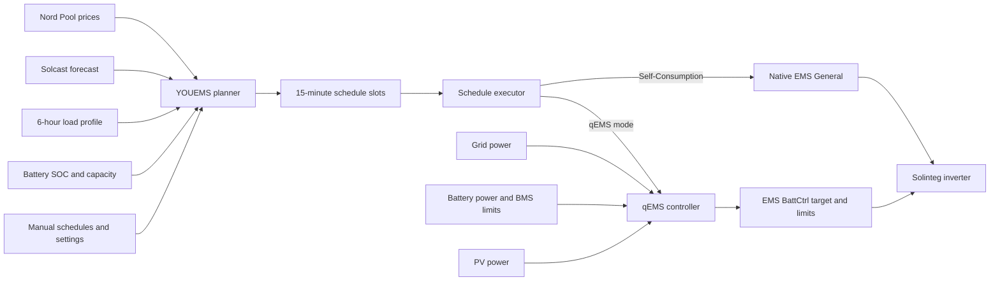

<!-- SPDX-License-Identifier: Apache-2.0 -->
<!-- Copyright 2026 Rickard Dahlstedt -->

# YOUEMS

**YOUEMS** is a Home Assistant energy-management system for a Solinteg hybrid inverter and battery. It combines Nord Pool electricity prices, Solcast PV forecasts, measured household consumption, battery state, and inverter feedback to create and execute a rolling 15-minute energy schedule.

The project has two main parts:

- **Planner:** decides when to charge, discharge, preserve the battery, export solar, or use normal self-consumption.
- **qEMS controller:** implements inverter behavior through Solinteg's `EMS BattCtrl` registers with fast external feedback from Home Assistant.

> [!WARNING]
> YOUEMS writes operating-mode and EMS control registers in a grid-connected inverter. It is built and tested for one specific Solinteg installation and is **not a universal drop-in package**. Verify every entity ID, register-backed control, power sign, battery limit, and grid rule before enabling real inverter writes. Begin with **Dry Run**.

## Current reference version

This README describes:

- Scheduler: `v2026.08.12.15.03`
- Dashboard: `v2026.08.12.15.03`

The tested system uses:

- Solinteg MHT-10K-25 inverter
- Pylontech Force H3 battery, 20.4 kWh
- 9.7 kWp PV
- Home Assistant
- Solax Modbus integration with Solinteg definitions
- Nord Pool SE3 prices
- Solcast PV forecasts
- Unagi SE3 electricity-price forecast for dashboard preview only

### Safe rollback baseline

Immediately before the Feed-In average-price redesign, the user explicitly selected this pair as the new safe rollback/regression baseline:

- Scheduler: `v2026.08.11.15.35`
- Dashboard: `v2026.08.12.00.23`

Keep those files available when diagnosing later planner regressions.

## What YOUEMS does

YOUEMS can:

- Build a schedule across today and tomorrow in 15-minute periods.
- Replan automatically every 15 minutes.
- Generate a schedule manually from a separate set of planner settings.
- Charge the battery during economically useful low-price periods.
- Preserve stored energy for expensive periods.
- Export selected morning solar when the price is favorable.
- Sell battery energy only when forecast solar is expected to refill it.
- Capture PV into the battery when future energy coverage is insufficient.
- Hold the battery completely idle during selected no-solar periods.
- Avoid rapid mode flickering by consolidating nearby schedule periods.
- Keep manual schedules protected while rebuilding automatic schedules.
- Preview plans and inverter actions with Dry Run.
- Display prices, forecast SOC, PV, schedules, status, savings, and planner diagnostics in a Lovelace dashboard.
- Preview Unagi hourly next-day price estimates in Plotly whenever actual Nord Pool tomorrow prices are not yet available; Unagi is display-only and does not feed the planner.

## System architecture



The planner performs the relatively heavy forecasting and optimization only during a replan. The qEMS controller is a small one-second feedback loop responsible for live inverter control between replans.

## Operating modes

### Native mode

| Mode | Implementation | Behavior |
|---|---|---|
| **Self-Consumption** | Inverter `EMS General` | The inverter handles normal self-consumption internally: PV supplies the house, surplus PV charges the battery, and the battery can supply the house when required. |

Self-Consumption intentionally does **not** use the external qEMS feedback loop. Native inverter control is preferred when ordinary self-consumption is the desired behavior.

### qEMS modes

All qEMS modes use `EMS BattCtrl`. Home Assistant calculates or maintains the battery-power target and applies mode-specific EMS import/export limits.

| Mode | Intended behavior |
|---|---|
| **qEMS Feed-In** | Exports available PV while preventing grid import. If PV is below household demand, the battery may cover the deficit. |
| **qEMS Self-Consumption** | External zero-grid-style self-consumption. The battery target is continuously adjusted to balance household demand after PV. |
| **qEMS PV Charge** | Sends available PV toward battery charging first. Inverter AC input is blocked for battery charging, but **this is not a site-level no-import mode**: the house may still import from the grid while PV is reserved for the battery. |
| **qEMS PV Charge+House** | PV supplies the house first and only remaining PV charges the battery. Battery discharge is prevented and grid charging of the battery is blocked. This is normally preferable when the goal is to avoid importing house load merely to prioritize battery charging. |
| **qEMS Battery Charge** | Charges at least the requested battery power, but automatically increases charging to absorb a larger PV surplus instead of exporting it. Grid charging is allowed for the requested shortfall. |
| **qEMS Battery Discharge** | Discharges at least the requested power while also covering higher household demand when needed. |
| **qEMS Battery Freeze** | Requests zero battery power and blocks both inverter AC directions. It is intended primarily for no-solar periods where the grid should supply the house and the battery must remain untouched. |

All seven qEMS modes have been tested on the reference installation.

## How the qEMS controller works

The qEMS controller runs once per second by default. It reads:

- Grid power
- Battery power
- PV power for diagnostics
- BMS maximum charging current
- BMS maximum discharging current
- Current BattCtrl target
- Current EMS inverter AC import/output limits

The controller then calculates a safe battery target for the active mode.

### Sign conventions

The current configuration assumes:

- Inverter grid meter: **positive = export**, **negative = import**
- Battery power: **positive = discharge**, **negative = charge**
- BattCtrl target: **positive = discharge**, **negative = charge**

These signs must be verified on every installation.

### Default qEMS tuning

The tested defaults are applied once on a new installation and then persist across Home Assistant restarts:

| Setting | Default |
|---|---:|
| Controller interval | 1 s |
| Post-write settling | 2 s |
| Grid deadband | 0.01 kW |
| Minimum target change | 0.01 kW |
| Maximum target step | 2 kW |
| Maximum target | 10 kW |

Battery Charge and Battery Discharge selected manually from the Inverter card begin at **0 kW**. For Battery Charge, 0 kW is now a **minimum** rather than a fixed zero: available PV surplus may still charge the battery.

### Battery Charge PV-surplus capture

`qEMS Battery Charge` treats the requested power as a **minimum battery-charge magnitude**, symmetrical in spirit with Battery Discharge treating its requested power as a minimum discharge magnitude.

Let `D = house load - PV = battery - grid`, where negative `D` means PV surplus, and let `R` be the requested positive charge magnitude. The controller uses:

```text
target = min(-R, D)
```

Equivalently, the battery charge magnitude is `max(R, PV surplus)`, bounded by qEMS Maximum Target and by the inverter/BMS.

Examples:

- Request 4 kW, PV surplus 1 kW → battery target ≈ -4 kW; grid supplies the remaining ≈3 kW.
- Request 4 kW, PV surplus 6 kW → battery target ≈ -6 kW; the extra PV is absorbed rather than exported.
- Request 0 kW, PV surplus 6 kW → battery target ≈ -6 kW; no grid battery charging is requested, but free PV is still captured.
- If PV surplus exceeds the configured qEMS maximum target or BMS acceptance, the unavoidable excess may still export.

This mode therefore requires fresh grid and battery feedback. The PV sensor itself remains diagnostic because `battery - grid` already yields demand after PV.

### Mode activation order

When entering `EMS BattCtrl`, YOUEMS always changes the inverter working mode first. Only after Home Assistant confirms `EMS BattCtrl` does it write:

1. PV priority
2. Maximum inverter AC output (register 50208; often labelled "Max Grid Export" by integrations)
3. Maximum inverter AC input (register 50209; often labelled "Max Grid Import" by integrations)
4. Initial BattCtrl target

This order matters because BattCtrl parameters written before the working-mode change may be stored/read back but still not be enforced by the inverter. **Register readback is therefore not proof that a pre-mode write took effect.** YOUEMS always enters and confirms `EMS BattCtrl` first, then writes the complete priority/limit/target set.

When qEMS is not active, working-mode changes also reassert unrestricted EMS AC limits, so restrictive settings left by a previous qEMS profile are not intentionally carried into another inverter mode. The inverter's actual working mode remains authoritative: if it is changed externally while a schedule is already running, qEMS stops rather than fighting the external change.

When the requested qEMS sub-mode is already active, YOUEMS preserves the live target and performs no initialization writes. This prevents a schedule boundary from momentarily resetting a battery that is charging or discharging at high power.

### Controller safety

- The BMS charging and discharging permissions gate target direction.
- Stale or invalid feedback pauses control and moves the target toward a safe value.
- Large target changes can be limited by Maximum Target Step.
- Grid noise inside the deadband is treated as zero.
- The fast loop writes only when the target change passes the configured threshold, except for urgent safety correction.
- Battery Charge is feedback-driven: its target may rise above the requested minimum when measured PV surplus is larger.
- If the inverter leaves `EMS BattCtrl`, the qEMS controller stops and clears its remembered sub-mode without forcing the inverter back.
- A remembered qEMS sub-mode is considered valid only while the inverter is actually in `EMS BattCtrl`.
- No battery charge-current or discharge-current registers are changed by YOUEMS.

## Shadow SOC estimator

YOUEMS keeps two Shadow SOC values. **Raw Shadow SOC** (`sensor.youems_shadow_battery_soc`) is deliberately unbounded and remains a diagnostic/calibration value: it may go below 0% or above 100% so accumulated measurement error remains visible. **Operational Shadow SOC** (`sensor.youems_operational_shadow_soc`) is the physically guarded 0–100% value used by the planner and by charge-acceptance bucket selection.

The estimator is anchored automatically only at a verified full-charge endpoint. During a continuous charge it arms when either SOC source reaches the high-SOC region (>=95%) while charge direction and BMS charge permission still indicate charging; a one-minute watchdog provides the same recovery if the exact crossing event is missed. When BMS maximum charge current subsequently transitions to zero after measurable charge movement, the endpoint is anchored as exactly 100%. There is deliberately no automatic low-SOC anchor. Manual re-sync controls remain available for diagnostics and recovery.

`input_number.youems_shadow_charge_loss_pct` is a separate Shadow-SOC measurement correction, adjustable from **0.0 to 5.0% in 0.1% steps**. It reduces measured charge energy before treating it as newly stored battery energy:

```text
stored charge = measured charge × (1 - Shadow Charge Loss / 100)
```

This setting is intentionally independent of the planner's charge/discharge or round-trip efficiency assumptions. It applies only to Shadow SOC charge accumulation; measured discharge energy is unchanged. Because the correction is applied when Shadow SOC is calculated rather than destructively written into the accumulated charge counter, changing the slider also recalculates the charge movement already accumulated since the current Shadow anchor.

To avoid hiding calibration error, raw Shadow SOC is never clamped. If raw Shadow SOC is above 100% when genuine discharge begins, YOUEMS latches the excess above 100% as a persistent **top correction**. Operational Shadow SOC then subtracts that correction before applying the physical 0–100% bounds. For example, if raw Shadow SOC is 102% when discharge starts, Operational Shadow SOC begins at 100%; when raw later reaches 90%, Operational Shadow SOC is 88%. This avoids a 2%-wide discharge dead zone while preserving the 102% raw value for diagnosis. The correction can only increase until the next trusted full/manual Shadow anchor, where it is cleared. The raw value immediately before a full anchor is retained as a diagnostic full-cycle error.

The planner now starts from Operational Shadow SOC. Force H3 SOC is retained only as an availability fallback if the operational Shadow estimator is temporarily unavailable. qEMS/BMS runtime safety guards remain independent and continue to use inverter/BMS feedback rather than trusting the planner SOC estimate.

## How the planner works

The planner uses a rolling look-ahead window, normally up to 48 hours. It combines:

- Nord Pool 15-minute prices
- Solcast P50 or conservative P10/P50-derived PV forecasts
- Current battery SOC and rated capacity
- Configured charging power and target energy
- Charge/discharge efficiency
- Minimum profitable price spread
- Battery SOC limits and sell buffer
- A measured time-of-day household load profile
- Manual schedules that must not be overwritten

### Household load model

Instead of using one flat daily average, YOUEMS divides consumption into four six-hour bands:

- 00:00–06:00
- 06:00–12:00
- 12:00–18:00
- 18:00–24:00

The package captures cumulative house-energy snapshots and averages available completed windows from up to three days. This produces a more realistic projected drain for each part of the day. A fallback daily estimate is used until enough history exists.

### Learned charge acceptance in prediction

YOUEMS learns the battery/BMS charge-acceptance ceiling with **non-uniform SOC buckets** so resolution is concentrated where the Force H3 actually changes its permitted charging current:

- 10–60%: 5%-spaced bucket starts (`10, 15, …, 60`)
- 60–85%: 2%-spaced bucket starts (`62, 64, …, 84`; the 60% bucket covers 60–62%)
- 85–100%: 1% buckets (`85, 86, …, 99`)

This produces 38 buckets. The curve is used when predicting how much energy can actually enter the battery during grid charge, PV Charge, PV Charge+House, and solar-surplus charging. For scheduled Battery Charge, prediction now uses the larger of the scheduled minimum charge request and forecast PV surplus, capped at the qEMS maximum target, matching the runtime controller's PV-surplus capture behavior. Plotly pSOC uses the same rule and the same bucket map/learned acceptance model.

To avoid learning temporary BMS restrictions or unusually high limits after shallow/partial cycles, charge-acceptance learning now requires a **qualified deep-charge session**. A session arms only when genuine battery charging is seen at or below **50% Operational Shadow SOC**. Once armed, YOUEMS may learn continuously on the upward charge through the higher SOC buckets. The session is discarded at full (>=99.9%), if Operational Shadow SOC falls at least 1.0 percentage point from the session peak, or if genuine charging is absent for five minutes. Home Assistant restart also starts disarmed, so an upper-SOC charge already in progress after restart is not treated as a qualified learning cycle. Brief pauses below five minutes are tolerated. The existing learned curve is not reset by this change.

The learned curve is **prediction-only**. It never reduces the qEMS Battery Charge command. If the configured grid-charge power is 10 kW and the learned curve predicts that the battery will currently accept only 4.4 kW, YOUEMS still requests 10 kW; the BMS remains responsible for enforcing its real charge limit. This avoids undercharging if the learned curve is conservative or stale.

If the curve is not fully learned, an unlearned SOC bucket (stored as 0), or an invalid/missing curve, is treated as **no known restriction**: prediction assumes the full requested or currently available charging power can be absorbed. Learned values only reduce predicted acceptance where an actual positive value exists.

The current package has no legacy 45→38 migration or startup recovery logic. The 38-value curve and 38-value sample-count stores are now the only supported format. A bucket whose sample count is zero treats its first valid observation as authoritative and replaces any stored seed immediately; after that, lower observations replace immediately and higher observations recover at 10% per sample. The manual **Reset Charge Acceptance Curve** control remains the explicit way to initialize or clear the stores.

Automatic grid-charge power is reduced only by the existing partial-final-slot logic: when the remaining required energy can be delivered without a full-power slot, the final slot is commanded at the calculated partial power (subject to Minimum Charge Power). The learned acceptance ceiling may cause the planner to reserve additional charge slots, but does not itself lower their requested power.

### Planner stages

The exact implementation is extensive, but the decision flow is broadly:

1. **Read inputs and project SOC** to the next 15-minute boundary.
2. **Protect manual and currently running periods.**
3. **Select charging periods** where low prices can economically offset later expensive consumption.
4. **Consolidate periods** to reduce mode changes and fragmented schedules.
5. **Allocate expensive periods** for battery-backed self-consumption.
6. **Create sell periods** when stored energy above the SOC buffer can be safely replenished by forecast solar.
7. **Create morning Feed-In periods** when export prices are attractive and enough solar/time remains to recharge safely.
8. **Fill all remaining periods** using the projected energy balance.
9. **Commit the final schedule once**, changing only helpers whose values actually differ.

### Charging

Charging periods are selected from lower-price slots when the price difference to avoided expensive consumption exceeds the configured minimum spread after efficiency is considered.

Additional controls include:

- Charge power
- Target battery energy
- Look-ahead length
- Cycle efficiency
- Minimum spread
- Forecast bias
- Overcharge buffer
- Contiguity preference
- Late Charge Acceptance

Late Charge Acceptance can delay charging into a slightly more expensive later period, allowing more time to see whether forecast solar actually arrives. Recharge safety still has priority.

### Self-consumption allocation

The planner estimates how many expensive periods can be covered by current battery energy, planned charging, forecast solar, and expected house consumption. These periods use native Self-Consumption so the inverter handles the real-time power flow internally. Deficit-day economic allocation uses the exact import tariff from `sensor.nordpool_kwh_se3_sek_4_10_025` and the exact export tariff from `sensor.nordpool_kwh_se3_sek_5_00_0`. Both sensors report SEK/kWh and are converted internally to öre/kWh.

### Sell logic

A planner “sell” period is executed as **qEMS Battery Discharge**.

Selling is deliberately conservative:

- It requires selling to be enabled.
- The price must exceed the configured minimum.
- Battery energy below the SOC buffer is protected.
- The energy must be expected to be recoverable from forecast solar.
- High simultaneous PV can block battery selling to avoid pointless discharge/recharge cycling.
- The final period can use partial power when the remaining energy budget cannot sustain maximum sell power for a full 15 minutes.
- Late Sell Acceptance can move a sell period later when the later price remains within the configured tolerance.

YOUEMS does **not** intentionally perform grid-to-grid arbitrage. It does not buy energy merely to sell it later because the planner does not maintain a reliable cost basis for every stored kilowatt-hour.

### Feed-In logic

Morning Feed-In is executed as **qEMS Feed-In**.

The planner can begin at the first forecast PV period. It uses price hysteresis so one cheap 15-minute period does not immediately break an otherwise useful export block:

- At least two of the first four available solar periods must meet the minimum Feed-In price.
- Once started, up to two below-threshold periods are tolerated in a rolling four-period window.
- Feed-In ends before the third below-threshold period.
- New Feed-In periods are limited to the morning/early daytime window.
- The planner verifies that sufficient forecast energy and charging time remain to restore the battery afterward.

**Minimum Feed-In Price Advantage** is a plain price comparison. YOUEMS identifies the morning 15-minute periods where Feed-In actually creates additional export, and the later periods where delayed charging would genuinely displace export after the battery catches up. Each qualifying period contributes its Nord Pool price **once**, regardless of how many kWh are exported in that period.

The decision is therefore:

```text
average morning Feed-In price
- average later displaced-export price
>= Minimum Feed-In Price Advantage
```

PV quantity still determines physical feasibility, SOC, recharge time, learned charge acceptance, and which later periods are genuinely displaced. It does **not** weight the price comparison. For example, selling 1 kWh at 30 öre is considered a better timing opportunity than later selling 2 kWh at 20 öre when the configured price advantage allows it; the larger later energy volume no longer wins merely because its total revenue is larger.

A setting of **0 Öre/kWh** allows equal average prices. After a Feed-In block has started, a weak 15-minute extension can remain provisional for up to one hour so following higher-price periods can rescue the equal-weighted average. If that one-hour extension still does not meet the configured price advantage, Feed-In ends before the first weak period.

### Final gap fill

After charge, sell, Feed-In, and protected periods are allocated, all remaining periods receive one of these modes:

- **Self-Consumption** when projected battery energy and solar can cover the plan, and after the battery is effectively full.
- **qEMS PV Charge** when battery recovery needs priority and using PV for the battery even if the house temporarily imports is economically/physically useful.
- **qEMS PV Charge+House** when forecast PV can supply the house first and the remaining surplus is still sufficient to refill the battery safely.
- **qEMS Battery Freeze** during no-solar deficit periods, preserving the battery while the grid supplies the load.

## Schedule storage and execution

YOUEMS provides 40 schedule slots:

- **Slots 01–05:** manual schedules
- **Slot 06:** protected carry-over slot used when an automatic replan occurs during an active automatic period
- **Slots 07–40:** automatically generated schedules

Each schedule stores:

- Enabled state
- Mode
- Start time
- End time
- Requested power where applicable

The executor starts and stops modes at their scheduled boundaries. Consecutive periods with the same effective mode are handed over without unnecessary inverter writes.

### Schedule state reconciliation

Exact-minute start/stop triggers remain the normal execution path, but YOUEMS also runs a self-healing reconciliation watchdog at Home Assistant startup and once per minute. It determines which enabled schedule should contain the current time (manual slots take priority over automatic slots) and repairs missed starts or stale active-slot bookkeeping. This covers Home Assistant restarts across a boundary, a missed template-trigger minute, and a replan that commits just after the boundary.

The watchdog deliberately does **not** force a qEMS mode back on when the expected slot is already tracked but the inverter working mode was changed externally. That preserves the safety invariant that the inverter/UI is authoritative and prevents a control tug-of-war.

During a replan, the complete replacement schedule is built in memory. The previous automatic schedule remains active until the replacement is ready, and only changed slot helpers are committed. This reduced measured replan time on the reference Home Assistant system from approximately **15.7 seconds to 4.6 seconds** and prevented most missed qEMS write cycles.

## Manual and automatic planning

The dashboard exposes two independent planner configurations:

### Inverter Schedule

A manually triggered planner. Press **Generate Schedule** to build a schedule using the settings in this card.

### Auto Inverter Scheduler

An automatic planner that replans every 15 minutes when enabled. It has a separate copy of the planner settings so automatic operation can be tuned independently from manual experiments.

Both cards support locking their settings to prevent accidental changes.

## Dry Run

Dry Run prevents package-controlled inverter commands while allowing the planner, schedules, and notifications to run normally.

Use Dry Run to verify:

- Entity mappings
- Power signs
- Forecast data
- Selected schedule periods
- Charge and sell powers
- SOC simulation
- Mode transitions

Do not disable Dry Run until the generated notification and dashboard schedule match the expected behavior.

## Dashboard

`dashboard.yaml` provides a complete Lovelace view with:

- Nord Pool price graph
- Forecast and actual battery SOC
- PV forecast and production
- Schedule overlays
- Manual schedule list and editor
- Inverter working-mode and sub-mode control
- qEMS Test Controller
- Manual Inverter Schedule planner
- Auto Inverter Scheduler
- Feed-In and Sell controls
- qEMS tuning and diagnostics
- Savings estimates
- Optional shadow-scan controls

The only custom Lovelace card currently required by the supplied dashboard is:

- **Plotly Graph Card** (`custom:plotly-graph`)

The Plotly projected-SOC trace uses a fixed **0–100% pSOC scale** and keeps full internal SOC precision instead of rounding plotted points to whole percentages. Hover text shows pSOC with one decimal. While the simulated battery is charging, its hover text also shows the charge-acceptance ceiling for that SOC bucket, for example `94.3% pSOC (⚡≤4.4 kW)`. A trailing `*` means the bucket is not learned and the display is showing the configured maximum-target assumption; the prediction itself continues to assume the full requested/available charging power can be absorbed for an unlearned bucket.

The thin Plotly history strip is backed by `input_text.schedule_history`, a compact newest-first interval stream encoded as `15-minute-index|period-count|mode-code`. Because Home Assistant `input_text` is limited to 255 characters, the writer normalizes the complete stream on every schedule start: duplicate, contained, overlapping, or directly adjacent intervals of the **same mode** are collapsed into one union interval before old entries are trimmed. This makes schedule-watchdog/reconciliation re-entry idempotent and prevents a long uninterrupted Self-Consumption period from consuming one history entry every 15 minutes.

The Inverter card’s **Sub Mode** dropdown is a command selector. It returns to `-` immediately after a selection. The separate status display shows the actual active sub-mode, or the inverter’s native working mode when no valid sub-mode is active.

## Required integrations and entities

The current files refer to entity IDs from one specific Home Assistant installation. Adapt them before use.

### EMS limit terminology

The Solax/Solinteg integration and official register descriptions may use names such as **Max Grid Export** and **Max Grid Import** for BattCtrl registers 50208/50209. In observed MHT firmware behavior these are **inverter-side AC output/input limits**, not utility-meter/site limits. House load is outside that limit calculation, so site import can exceed the configured inverter AC input limit and site export can be lower than the configured inverter AC output. Do not use these registers as service-fuse or whole-site import/export protection.

### Essential inverter controls

| Purpose | Current entity ID |
|---|---|
| Working mode | `select.solax_inverter_working_mode` |
| BattCtrl target | `number.solax_inverter_battery_charge_discharge_power_target` |
| BattCtrl PV priority | `select.solinteg_inverter_solax_inverter_ems_battctrl_priority_of_power_output` |
| BattCtrl maximum inverter AC output | `number.solinteg_inverter_solax_inverter_ems_battctrl_max_ac_power_limit` |
| BattCtrl maximum inverter AC input | `number.solinteg_inverter_solax_inverter_ems_battctrl_min_ac_power_limit` |

### Essential power and battery sensors

| Purpose | Current entity ID |
|---|---|
| Grid power | `sensor.solax_inverter_meter_active_power` |
| Battery power | `sensor.solax_inverter_battery_power` |
| PV power | `sensor.solax_inverter_pv_power_total` |
| Decimal planner SOC | `sensor.force_h3_battery_percent` |
| Inverter SOC (runtime safety guard) | `sensor.solax_inverter_battery_soc` |
| Battery rated capacity | `sensor.solax_inverter_battery_rated_capacity` |
| Battery voltage | `sensor.solax_inverter_battery_voltage` |
| BMS maximum charging current | `sensor.solax_inverter_battery_charge_limit` |
| BMS maximum discharging current | `sensor.solax_inverter_battery_discharge_limit` |
| House cumulative energy | `sensor.solax_inverter_house_energy_total` |

### Price and PV forecast entities

| Purpose | Current entity ID |
|---|---|
| Planner price series | `sensor.nordpool_kwh_se3_sek_0_200000_0` |
| Unagi next-day dashboard preview only | `sensor.unagi_se3` |
| Exact import price (SEK/kWh) | `sensor.nordpool_kwh_se3_sek_4_10_025` |
| Exact export price (SEK/kWh) | `sensor.nordpool_kwh_se3_sek_5_00_0` |
| Solcast today | `sensor.solcast_pv_forecast_forecast_today` |
| Solcast tomorrow | `sensor.solcast_pv_forecast_forecast_tomorrow` |
| Solcast remaining today | `sensor.solcast_pv_forecast_forecast_remaining_today` |

The Solcast forecast entities must expose a `detailedForecast` attribute containing period start times and PV estimates.

`sensor.unagi_se3` is intentionally **not** a planner input. The Plotly card uses its native hourly `raw_tomorrow` values only while the Nord Pool planner-price sensor does not have valid tomorrow data. Unagi values are SEK/kWh and are multiplied by 100 only for the dashboard's öre/kWh display. The hourly periods are rendered as one-hour forecast bars rather than being expanded into artificial 15-minute prices. For the visual trace, the card deliberately declares the same Nord Pool entity as the real price trace so Plotly Graph Card assigns both traces to the same automatic price-axis/unit group; the custom `$fn` x/y/width/color data still comes from `sensor.unagi_se3`. This avoids the explicit `yaxis` override that Home Assistant rejected in the previous attempted revision. Unagi remains zero-based and the card uses overlay bar mode. Unagi bars use 99% of their one-hour interval plus a dark outline, leaving only a very small visual gap between hourly forecast bars. While those Unagi-only bars are visible, the Plotly **Solar** trace and average-consumption/**Drain** trace are extended across the same visual horizon so tomorrow is not shown as price-only. This extension is display-only: pSOC, schedule simulation, and all planner calculations remain bounded by actual Nord Pool data. As soon as actual Nord Pool tomorrow prices become valid, the Unagi preview disappears and the visual overlays naturally use the real Nord Pool horizon.

## Documentation acknowledgements

Independent Solinteg testing and review from [hspolander/solinteg-controller-oss](https://github.com/hspolander/solinteg-controller-oss) helped confirm and sharpen several EMS BattCtrl documentation points, including the mode-before-register write-order requirement, the fact that a pre-mode limit can read back correctly without being enforced, and the inverter-side (not utility-meter-side) meaning of registers 50208/50209. The PV Charge house-import behavior was also independently reproduced there.

## License and attribution

YOUEMS is distributed under the **Apache License 2.0**. See `LICENSE` for the license text and `NOTICE` for attribution information. You may use, copy, and modify the project under those terms. Redistributed or published derivatives should retain the copyright/license notices and the YOUEMS attribution notice, including a link back to the original YOUEMS source repository from which the work was obtained.

## Installation

### 1. Enable Home Assistant packages

Add a packages directory to `configuration.yaml` if one is not already configured:

```yaml
homeassistant:
  packages: !include_dir_named integrations
```

The directory name is arbitrary. The example uses `config/integrations/`.

### 2. Copy the scheduler package

Copy the latest scheduler YAML file into the packages directory. A simple repository installation can rename it to:

```text
config/integrations/solinteg_schedule.yaml
```

If Home Assistant rejects periods in a package slug or filename, use underscores in the installed filename.

### 3. Adapt external entity IDs

Search the scheduler and dashboard for the entity IDs listed above and replace them with the corresponding entities from your installation.

Pay particular attention to:

- `solax_inverter` versus `solinteg_inverter` prefixes
- Grid and battery power signs
- EMS BattCtrl import/export-limit units
- Battery rated-capacity unit
- BMS current signs
- Nord Pool area, currency, taxes, and fees
- Solcast forecast entity names

### 4. Restart Home Assistant

A full restart is recommended after installing the package so all helpers, scripts, template sensors, and automations are created together.

Check **Settings → System → Logs** for disabled automations, invalid selectors, missing entities, or template errors.

### 5. Install the dashboard dependency

Install Plotly Graph Card, normally through HACS, and add its frontend resource if HACS has not done so automatically.

### 6. Add the dashboard

Create a new dashboard or view, open the raw YAML editor, and paste the supplied dashboard configuration. Replace external entity IDs as needed.

### 7. Start in Dry Run

1. Enable Dry Run.
2. Confirm Nord Pool and Solcast data are present.
3. Generate a manual schedule.
4. Review the schedule graph and notification.
5. Test each qEMS mode at low power.
6. Confirm Modbus writes and signs independently.
7. Disable Dry Run only after verification.

## Test Controller

The separate qEMS Test Controller card is intentionally retained for commissioning and diagnostics. It allows a mode to be applied directly and exposes detailed controller status.

Use it to verify:

- Working-mode activation order
- Import/export limits
- BattCtrl target direction
- BMS blocking behavior
- Grid response
- Target settling and maximum-step behavior
- Clean stop and restoration of the previous inverter state

The normal Inverter card and schedules do not require pressing a separate Start button; selecting or scheduling a qEMS mode activates it directly.

## Write minimization

Although EMS registers are suitable for repeated control, YOUEMS avoids unnecessary state churn and unsafe reinitialization:

- The planner commits the final schedule only once.
- Unchanged schedule helpers are not rewritten.
- The currently running automatic period is protected during replanning.
- Same-mode qEMS handoffs preserve the live BattCtrl target and limits.
- Consecutive native Self-Consumption periods produce no mode reset.
- Working mode is written before BattCtrl parameters when entering `EMS BattCtrl`.
- The fast loop writes the target only when required by feedback or safety.

Mode changes deliberately reassert PV priority and EMS import/export limits so stale limits from a previous mode cannot remain active.

## Notifications and diagnostics

Planner notifications include sections for:

- Settings
- Battery and consumption
- Six-hour load profile
- Nord Pool price window
- Charge schedule
- Discharge and sell schedule
- Feed-In schedule
- Forecast assumptions
- Minimum simulated SOC
- Planner runtime stages

A slow planner run is also written to the Home Assistant system log. Runtime helpers separate calculation time from schedule commit time.

## Optional auxiliary features

The package also contains installation-specific features that can be removed if not needed:

- Automatic export-limit control using price thresholds and hysteresis
- Solinteg shadow-scan automation using solar azimuth/elevation
- Solar-excess smoothing helpers
- Import/export savings estimation
- Daily and monthly savings tracking

These features use additional entities and tariff assumptions that must be reviewed for each installation.

## Limitations

- The package is highly installation-specific and currently uses hard-coded external entity IDs.
- YAML/Jinja planning runs inside Home Assistant and is not a real-time process.
- qEMS timing depends on Home Assistant load, integration polling intervals, and Modbus responsiveness.
- Forecast quality directly affects schedule quality.
- Consumption history takes time to build.
- Savings figures are estimates, not billing-grade calculations.
- Battery degradation, taxes, network tariffs, and export compensation vary by installation.
- The planner does not track the exact acquisition cost of energy currently stored in the battery.
- Grid-code and export-limit requirements must be configured for the local installation.

## Recommended commissioning checklist

- [ ] Verify all external entity IDs.
- [ ] Verify grid-power sign.
- [ ] Verify battery-power sign.
- [ ] Verify BattCtrl target sign.
- [ ] Verify EMS import/export-limit semantics and units.
- [ ] Verify BMS current signs and zero-current blocking behavior.
- [ ] Confirm `EMS General` performs native Self-Consumption correctly.
- [ ] Test every qEMS mode at 0 kW or low power.
- [ ] Confirm qEMS Battery Freeze leaves the battery untouched.
- [ ] Confirm leaving `EMS BattCtrl` stops qEMS without fighting the inverter.
- [ ] Run the planner in Dry Run.
- [ ] Review minimum simulated SOC and schedule overlaps.
- [ ] Confirm schedule starts and stops in Modbus logs.
- [ ] Enable automatic replanning only after several successful manual plans.

## Project files

| File | Purpose |
|---|---|
| `solinteg_schedule_*.yaml` | Home Assistant package containing helpers, templates, scripts, automations, planner, schedules, qEMS controller, and optional auxiliary features |
| `dashboard_*.yaml` | Complete Lovelace dashboard/view configuration |
| `README.md` | Project overview, architecture, installation, and operating notes |

## Project status

YOUEMS is an actively developed personal project. It has evolved through live testing on the reference inverter and battery system. The current qEMS modes are operational, automatic replanning has been optimized to avoid long Home Assistant stalls, and same-mode schedule handoffs preserve live BattCtrl control without target jumps.

Contributions and reports should include:

- Home Assistant version
- Inverter model and firmware
- Battery model
- Relevant entity IDs and units
- Generated planner notification
- Home Assistant automation/script errors
- Modbus write log around the problem

