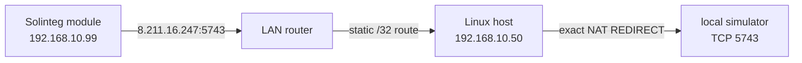

<!-- SPDX-License-Identifier: Apache-2.0 -->
<!-- Copyright 2026 Rickard Dahlstedt -->

# solinteg-cloud-simulator

`solinteg-cloud-simulator` is a small local replacement for the Solinteg cloud
telemetry endpoint. It accepts the inverter communication module's TCP
connection and immediately returns the same application acknowledgement that
was observed from the real server.

This is **not** a Modbus simulator. It does not read or write inverter
registers. Its purpose is to keep cloud telemetry work from blocking the
communication module and, indirectly, delaying local Modbus TCP traffic.

The simulator does not forward traffic to Solinteg or deliberately delay
replies. It saves no telemetry payloads unless the optional unknown-frame
logger is explicitly enabled.

## Why this exists

On the tested installation, Modbus TCP replies normally arrived in about
0.02 seconds. When the cloud path was unavailable or laggy, Modbus reads
periodically took 4–8 seconds or timed out. Silently dropping or actively
rejecting the cloud connection made the problem much worse—at one point about
95% of Modbus requests failed.

Proxying the cloud connection through a working Internet path removed the
Modbus delays. Captures of that connection then showed that the server's reply
is a small deterministic acknowledgement. This program generates that reply
locally, so the communication module sees a successful cloud transaction
without any Internet dependency.

The confirmed destination is exactly:

```text
8.211.16.247/32, TCP port 5743
```

An earlier suspected network, `155.102.215.0/24`, is **not used** by this
package and should not be redirected or blocked on its behalf.

## Tested topology



The LAN router must have a static route for `8.211.16.247/32` via the Linux
host. The included firewall service then redirects only packets matching all
of these fields:

- incoming interface;
- inverter source address `/32`;
- cloud destination address `8.211.16.247/32`;
- TCP destination port `5743`.

No general cloud subnet block or redirect is installed.

## Protocol findings

The following was derived from packet captures of one installation. Captured
identifiers, manufacturers, and live measurements are intentionally omitted
from this document.

- Telemetry uses unencrypted TCP on port 5743.
- Client frames start with `ST`.
- Bytes 2–5 contain a big-endian length equal to total frame length minus 9.
- The final two bytes are CRC-16/Modbus in little-endian wire order.
- The real server returns a deterministic 58-byte acknowledgement.
- Captured request types were `01:03`, `01:04`, and `01:44`.
- The generated replies matched all 17 captured genuine server replies exactly.
- Reply generation took approximately 0.077 ms during development testing.

### Register snapshots inside the cloud frames

The cloud payload is not a raw Modbus RTU frame or a Modbus TCP ADU. It is a
proprietary envelope containing sparse snapshots of actual Solinteg Modbus
registers. Register addresses, 16-bit values, multi-register values, strings,
byte order, and scaling all match the published register table and the
Solinteg definitions in
[`wills106/homeassistant-solax-modbus`](https://github.com/wills106/homeassistant-solax-modbus/blob/main/custom_components/solax_modbus/plugin_solinteg.py).

After the common 32-byte `ST` header, the observed request payload is:

| Offset | Size | Meaning |
|---:|---:|---|
| 32 | 10 bytes | Reserved; zero in the observed frames |
| 42 | 6 bytes | Snapshot timestamp: year, month, day, hour, minute, second |
| 48 | 1 byte | Number of register-range records |
| 49 | Variable | Register-range records |
| Variable | Variable | `FF` padding to the fixed packet-family size |
| Final | 2 bytes | CRC-16/Modbus, low byte first |

Each register-range record has this structure:

```text
U16 big-endian  first register address
U16 big-endian  last register address, inclusive
U16 big-endian  value of first register
U16 big-endian  value of first register + 1
...
U16 big-endian  value of last register
```

The frame timestamp at bytes 26–31 records transmission time. The second
timestamp at bytes 42–47 records when the register snapshot was taken. They
normally match for current data but differ for buffered historical data.

Across the captured packet families, 907 distinct register addresses were
present. The current Solinteg plugin can decode 91 named entities from those
ranges, including device information, electrical measurements, energy
counters, battery state, limits, temperatures, and diagnostic fields. No
captured identifier, manufacturer string, or measurement is required to
describe or reproduce the packet structure.

The simulator includes the complete translation metadata from Modbus Broker
v5.12. That table combines the current Home Assistant Solinteg plugin with
Solinteg protocol v00.02 and covers unsigned and signed 16/32-bit values,
scaling, units, strings, versions, packed date/time fields, enums, alarm/status
bits, and the BMS status word. The optional verbose logger applies those same
translations directly to every register range carried by the cloud frame.

### Known request types

| Type | Observed size | Register records | Register values | Observed purpose |
|---|---:|---:|---:|---|
| `01:03` | 1,186 bytes | 34 | 497 | Device and configuration snapshot used during connection setup |
| `01:04` | 930 bytes | 12 | 410 | Current full telemetry snapshot, normally sent about once per minute |
| `01:44` | 594 bytes | 8 | 249 | Buffered historical telemetry snapshot |

The 249 addresses in `01:44` are an exact subset of the `01:04` addresses. In
the capture, a successful reconnection was followed by a burst of `01:44`
frames whose snapshot timestamps advanced in five-minute steps and ended near
the current time. This is strong evidence that the communication module uses
`01:44` to backfill measurements accumulated while cloud communication was
unavailable.

The type numbers resemble Modbus function codes, but that relationship has not
been proven. They should be treated as cloud-protocol message types. Solinteg's
published external Modbus RTU protocol documents functions `03`, `06`, and
`16`, while these cloud frames use their own batching format.

### Relationship to the Modbus delays

When a TCP sink accepted the connection but returned no application reply, the
same `01:03` register snapshot was retried at approximately 20-second
intervals. With valid application acknowledgements, the module completed its
setup and settled into the normal current-telemetry cadence.

This suggests that a failed cloud transaction repeatedly makes the
communication module gather or process hundreds of inverter registers over
the same internal communication path used by local Modbus. That mechanism is
consistent with the observed local Modbus stalls and with DROP, REJECT, or an
acknowledgement-free TCP sink making the problem substantially worse. This is
an evidence-based explanation, but the module's internal scheduling remains
undocumented.

Valid frames of previously unseen types are logged and acknowledged by
default. Frames with an invalid length or CRC are logged and are never
acknowledged. The `--strict-known-types` option is available for experiments,
but is intentionally not enabled by the service.

## Requirements

- Linux with systemd
- Python 3.9 or later
- `iptables-nft`
- IPv4 forwarding enabled on the interception host
- a LAN-router static route for `8.211.16.247/32` via that host

The separate `nft` and `conntrack` command-line tools are not required. This
package deliberately calls `iptables-nft`, so an unrelated legacy iptables
ruleset is not modified.

## Installation

The supplied defaults describe the installation on which this was developed:

```ini
LAN_INTERFACE=enxb827ebf678ea
SIMULATOR_ADDRESS=192.168.10.50
INVERTER_ADDRESS=192.168.10.99
CLOUD_ADDRESS=8.211.16.247
LISTEN_PORT=5743
SIMULATOR_OPTIONS=
```

1. Configure the router with a static host route:

   ```text
   8.211.16.247/32 via 192.168.10.50
   ```

2. Edit `solinteg-cloud-simulator.conf` if any interface or address differs.

3. Install and start the service:

   ```bash
   chmod +x install.sh
   sudo ./install.sh
   ```

The installer copies the program to `/opt/solinteg-cloud-simulator`, installs
the configuration at `/etc/default/solinteg-cloud-simulator`, installs the two
systemd units, enables automatic startup, and starts the simulator. An existing
configuration file is preserved during upgrades.

The main unit uses `Restart=always` with a one-second restart delay. Its
companion oneshot unit installs the exact redirect before the simulator starts
and removes that same rule when the service is stopped.

## Verification

Check the service and follow its log:

```bash
sudo systemctl status solinteg-cloud-simulator.service
sudo journalctl -u solinteg-cloud-simulator.service -f
```

Check the exact firewall rule and its packet counter:

```bash
sudo iptables-nft -t nat -L PREROUTING -n -v --line-numbers
sudo /opt/solinteg-cloud-simulator/solinteg-cloud-simulator-firewall.sh status
```

Run the built-in protocol and CRC test:

```bash
sudo /usr/bin/python3 \
  /opt/solinteg-cloud-simulator/solinteg-cloud-simulator.py --self-test
```

The module may connect only about once every five minutes when communication
is healthy, and it may keep a TCP connection open between transmissions. The
simulator therefore has no artificial response delay and no idle socket
timeout. Seeing no new connection for a few minutes is not by itself a fault.

## Logging options

Both diagnostic modes run only after the protocol acknowledgement has been
sent. Decoding and file I/O therefore do not delay the cloud reply.

### `--verbose`

This logs every register snapshot sent by the inverter. Fields known to Modbus
Broker v5.12 are logged with register address, name, raw register word(s),
translated value, scale, unit, enum, or active flags as applicable. Every
unmapped register word is still logged as `Raw Field`, so no transmitted
register value is silently omitted.

Example for a manual foreground run:

```bash
sudo /usr/bin/python3 \
  /opt/solinteg-cloud-simulator/solinteg-cloud-simulator.py \
  --bind 192.168.10.50 --port 5743 --verbose
```

This can produce several hundred journal lines per telemetry frame. It is
intended for protocol inspection, not routine operation.

### `--log-unknown [PATH]`

This saves only valid frames whose two-byte message type has not previously
been identified. Known `01:03`, `01:04`, and `01:44` frames are never written
by this option. Each unknown frame becomes one JSON Lines record containing
capture time, peer, type, length, SHA-256, and the complete frame encoded as
base64. The default file is:

```text
/var/log/solinteg-cloud-simulator/unknown-frames.jsonl
```

The systemd unit creates that directory with mode `0700`; files are created
with mode `0600`. To reconstruct the newest saved frame:

```bash
sudo tail -n 1 \
  /var/log/solinteg-cloud-simulator/unknown-frames.jsonl \
  | jq -r .frame_base64 \
  | base64 -d > unknown-solinteg-frame.bin
```

An explicit alternate destination can be supplied as the next argument, for
example `--log-unknown /tmp/unknown-frames.jsonl`.

### Enabling options under systemd

Set `SIMULATOR_OPTIONS` in `/etc/default/solinteg-cloud-simulator`, then restart
the service. Use either flag independently or both together:

```ini
SIMULATOR_OPTIONS="--verbose --log-unknown"
```

```bash
sudo systemctl restart solinteg-cloud-simulator.service
sudo journalctl -u solinteg-cloud-simulator.service -f
```

The installer preserves an existing configuration during upgrades. If the
file predates these options, add `SIMULATOR_OPTIONS=` to it manually before
enabling either mode.

## Troubleshooting

### No connection appears

- Wait at least five minutes.
- Confirm the router's `/32` route points to the Linux host.
- Confirm IPv4 forwarding with `sysctl net.ipv4.ip_forward`.
- Check whether the exact PREROUTING rule's counter increases.
- If necessary, restart only the inverter communication module after the
  simulator is ready. Avoid interrupting the inverter power stage unless its
  documentation explicitly requires that.

### The firewall counter remains zero

The packet is not reaching the Linux host. The common causes are a missing or
incorrect router route, a different current cloud address, or a communication
module that has not yet retried.

### Port 5743 is already in use

Stop any earlier `socat`, `nc`, or manually launched simulator process, then
restart the service:

```bash
sudo ss -ltnp 'sport = :5743'
sudo systemctl restart solinteg-cloud-simulator.service
```

### The service will not start

Inspect both units and the recent journal:

```bash
sudo systemctl status \
  solinteg-cloud-simulator.service \
  solinteg-cloud-simulator-firewall.service
sudo journalctl -u solinteg-cloud-simulator.service -n 100 --no-pager
sudo journalctl -u solinteg-cloud-simulator-firewall.service -n 100 --no-pager
```

## Upgrade

Pull or download the new files, review any changed example configuration, and
run the installer again:

```bash
sudo ./install.sh
```

The live file at `/etc/default/solinteg-cloud-simulator` is not overwritten.

## Uninstall

Stopping the main service also invokes the firewall unit's `ExecStop`, which
removes the redirect managed by this package:

```bash
sudo systemctl disable --now solinteg-cloud-simulator.service
sudo rm -f \
  /etc/systemd/system/solinteg-cloud-simulator.service \
  /etc/systemd/system/solinteg-cloud-simulator-firewall.service
sudo rm -rf /opt/solinteg-cloud-simulator
sudo rm -f /etc/default/solinteg-cloud-simulator
sudo systemctl daemon-reload
```

Review `iptables-nft -t nat -L PREROUTING -n -v --line-numbers` afterwards.
Rules from earlier manual experiments are outside this package and are not
removed automatically.

## Limits and safety

This is experimental, independently developed software based on captures from
one Solinteg hybrid-inverter installation. Other models, firmware versions,
regions, or future cloud protocol revisions may behave differently.

Redirecting the endpoint disables delivery of the intercepted telemetry to the
vendor and may affect cloud monitoring, remote diagnostics, firmware services,
warranty support, or safety notifications. Keep local monitoring and a tested
rollback path. Do not expose the simulator listener to untrusted networks.

The simulator normally logs the communication-module serial number, message
type, frame length, and device timestamp to the system journal. `--verbose`
adds decoded live measurements to that journal. `--log-unknown` writes complete
unknown frames to disk; those frames can contain identifiers, configuration,
and live measurements. Treat diagnostic logs as private and scrub them before
sharing.

This project is not affiliated with or endorsed by Solinteg. Solinteg is a
trademark of its respective owner.

## License

Copyright 2026 Rickard Dahlstedt.

Licensed under the [Apache License 2.0](LICENSE). This component is part of
[YOUEMS](https://github.com/sixuniform/YOUEMS).
