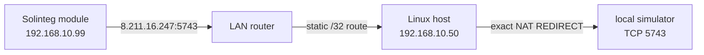

<!-- SPDX-License-Identifier: Apache-2.0 -->
<!-- Copyright 2026 Rickard Dahlstedt -->

# solinteg-cloud-simulator

`solinteg-cloud-simulator` is a small local replacement for the Solinteg cloud
telemetry endpoint. It accepts the inverter communication module's TCP
connection and immediately returns the same application acknowledgement that
was observed from the real server.

This is **not** a Modbus simulator. It does not read or write inverter
registers. Its purpose is to keep cloud telemetry work from blocking the
communication module and, indirectly, delaying local Modbus TCP traffic.

The simulator does not forward traffic to Solinteg, save telemetry payloads,
or deliberately delay replies.

## Why this exists

On the tested installation, Modbus TCP replies normally arrived in about
0.02 seconds. When the cloud path was unavailable or laggy, Modbus reads
periodically took 4–8 seconds or timed out. Silently dropping or actively
rejecting the cloud connection made the problem much worse—at one point about
95% of Modbus requests failed.

Proxying the cloud connection through a working Internet path removed the
Modbus delays. Captures of that connection then showed that the server's reply
is a small deterministic acknowledgement. This program generates that reply
locally, so the communication module sees a successful cloud transaction
without any Internet dependency.

The confirmed destination is exactly:

```text
8.211.16.247/32, TCP port 5743
```

An earlier suspected network, `155.102.215.0/24`, is **not used** by this
package and should not be redirected or blocked on its behalf.

## Tested topology



The LAN router must have a static route for `8.211.16.247/32` via the Linux
host. The included firewall service then redirects only packets matching all
of these fields:

- incoming interface;
- inverter source address `/32`;
- cloud destination address `8.211.16.247/32`;
- TCP destination port `5743`.

No general cloud subnet block or redirect is installed.

## Protocol findings

The following was derived from packet captures of one installation:

- Telemetry uses unencrypted TCP on port 5743.
- Client frames start with `ST`.
- Bytes 2–5 contain a big-endian length equal to total frame length minus 9.
- The final two bytes are CRC-16/Modbus in little-endian wire order.
- The real server returns a deterministic 58-byte acknowledgement.
- Captured request types were `01:03`, `01:04`, and `01:44`.
- The generated replies matched all 17 captured genuine server replies exactly.
- Reply generation took approximately 0.077 ms during development testing.

Valid frames of previously unseen types are logged and acknowledged by
default. Frames with an invalid length or CRC are logged and are never
acknowledged. The `--strict-known-types` option is available for experiments,
but is intentionally not enabled by the service.

## Requirements

- Linux with systemd
- Python 3.9 or later
- `iptables-nft`
- IPv4 forwarding enabled on the interception host
- a LAN-router static route for `8.211.16.247/32` via that host

The separate `nft` and `conntrack` command-line tools are not required. This
package deliberately calls `iptables-nft`, so an unrelated legacy iptables
ruleset is not modified.

## Installation

The supplied defaults describe the installation on which this was developed:

```ini
LAN_INTERFACE=enxb827ebf678ea
SIMULATOR_ADDRESS=192.168.10.50
INVERTER_ADDRESS=192.168.10.99
CLOUD_ADDRESS=8.211.16.247
LISTEN_PORT=5743
```

1. Configure the router with a static host route:

   ```text
   8.211.16.247/32 via 192.168.10.50
   ```

2. Edit `solinteg-cloud-simulator.conf` if any interface or address differs.

3. Install and start the service:

   ```bash
   chmod +x install.sh
   sudo ./install.sh
   ```

The installer copies the program to `/opt/solinteg-cloud-simulator`, installs
the configuration at `/etc/default/solinteg-cloud-simulator`, installs the two
systemd units, enables automatic startup, and starts the simulator. An existing
configuration file is preserved during upgrades.

The main unit uses `Restart=always` with a one-second restart delay. Its
companion oneshot unit installs the exact redirect before the simulator starts
and removes that same rule when the service is stopped.

## Verification

Check the service and follow its log:

```bash
sudo systemctl status solinteg-cloud-simulator.service
sudo journalctl -u solinteg-cloud-simulator.service -f
```

Check the exact firewall rule and its packet counter:

```bash
sudo iptables-nft -t nat -L PREROUTING -n -v --line-numbers
sudo /opt/solinteg-cloud-simulator/solinteg-cloud-simulator-firewall.sh status
```

Run the built-in protocol and CRC test:

```bash
sudo /usr/bin/python3 \
  /opt/solinteg-cloud-simulator/solinteg-cloud-simulator.py --self-test
```

The module may connect only about once every five minutes when communication
is healthy, and it may keep a TCP connection open between transmissions. The
simulator therefore has no artificial response delay and no idle socket
timeout. Seeing no new connection for a few minutes is not by itself a fault.

## Troubleshooting

### No connection appears

- Wait at least five minutes.
- Confirm the router's `/32` route points to the Linux host.
- Confirm IPv4 forwarding with `sysctl net.ipv4.ip_forward`.
- Check whether the exact PREROUTING rule's counter increases.
- If necessary, restart only the inverter communication module after the
  simulator is ready. Avoid interrupting the inverter power stage unless its
  documentation explicitly requires that.

### The firewall counter remains zero

The packet is not reaching the Linux host. The common causes are a missing or
incorrect router route, a different current cloud address, or a communication
module that has not yet retried.

### Port 5743 is already in use

Stop any earlier `socat`, `nc`, or manually launched simulator process, then
restart the service:

```bash
sudo ss -ltnp 'sport = :5743'
sudo systemctl restart solinteg-cloud-simulator.service
```

### The service will not start

Inspect both units and the recent journal:

```bash
sudo systemctl status \
  solinteg-cloud-simulator.service \
  solinteg-cloud-simulator-firewall.service
sudo journalctl -u solinteg-cloud-simulator.service -n 100 --no-pager
sudo journalctl -u solinteg-cloud-simulator-firewall.service -n 100 --no-pager
```

## Upgrade

Pull or download the new files, review any changed example configuration, and
run the installer again:

```bash
sudo ./install.sh
```

The live file at `/etc/default/solinteg-cloud-simulator` is not overwritten.

## Uninstall

Stopping the main service also invokes the firewall unit's `ExecStop`, which
removes the redirect managed by this package:

```bash
sudo systemctl disable --now solinteg-cloud-simulator.service
sudo rm -f \
  /etc/systemd/system/solinteg-cloud-simulator.service \
  /etc/systemd/system/solinteg-cloud-simulator-firewall.service
sudo rm -rf /opt/solinteg-cloud-simulator
sudo rm -f /etc/default/solinteg-cloud-simulator
sudo systemctl daemon-reload
```

Review `iptables-nft -t nat -L PREROUTING -n -v --line-numbers` afterwards.
Rules from earlier manual experiments are outside this package and are not
removed automatically.

## Limits and safety

This is experimental, independently developed software based on captures from
one Solinteg MHT-10K-25 installation whose communication module reported
firmware `3.1.0.0(01)`. Other models, firmware versions, regions, or future
cloud protocol revisions may behave differently.

Redirecting the endpoint disables delivery of the intercepted telemetry to the
vendor and may affect cloud monitoring, remote diagnostics, firmware services,
warranty support, or safety notifications. Keep local monitoring and a tested
rollback path. Do not expose the simulator listener to untrusted networks.

The simulator currently logs the communication-module serial number, message
type, frame length, and device timestamp to the system journal. It does not
write the telemetry payload to disk.

This project is not affiliated with or endorsed by Solinteg. Solinteg and
Pylontech are trademarks of their respective owners.

## License

Copyright 2026 Rickard Dahlstedt.

Licensed under the [Apache License 2.0](LICENSE). This component is part of
[YOUEMS](https://github.com/sixuniform/YOUEMS).
