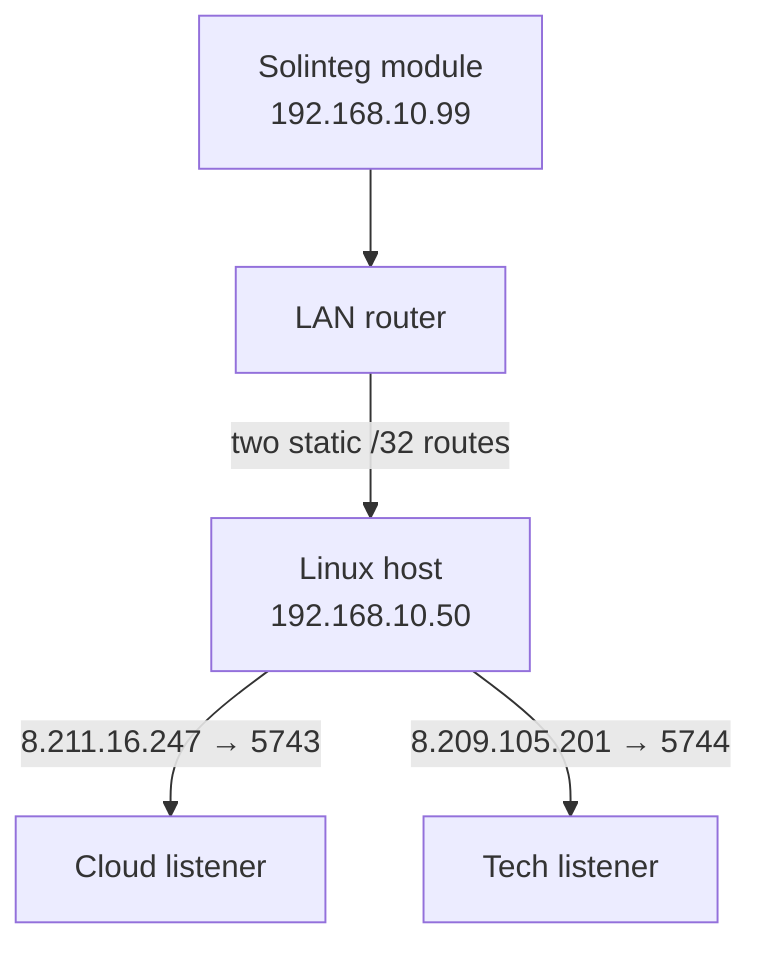

<!-- SPDX-License-Identifier: Apache-2.0 -->
<!-- Copyright 2026 Rickard Dahlstedt -->

# solinteg-cloud-simulator

`solinteg-cloud-simulator` is a small local replacement for the two observed
Solinteg TCP endpoints. It accepts the inverter communication module's normal
cloud connection on local port `5743` and its technical-service connection on
local port `5744`, keeping the streams separate. It immediately returns the
same application acknowledgement that was observed from the real server.

It can optionally mirror a copy of each acknowledged inverter frame to the
matching real hostname through a SOCKS5 proxy. This forwarding path is
deliberately one-way by default: bytes received from either server are logged
and ignored. A separate, explicit test switch can temporarily forward normal
cloud commands while their real inverter responses are being reverse
engineered. Another explicit mode keeps `01:10` writes blocked but returns a
locally generated success acknowledgement to the cloud. These command modes
apply only to the normal cloud endpoint; technical-server input is always
ignored.

This is **not** a Modbus simulator. It does not read or write inverter
registers. Its purpose is to keep cloud telemetry work from blocking the
communication module and, indirectly, delaying local Modbus TCP traffic.

Cloud mirroring is disabled by default. The simulator never deliberately
delays local replies. It saves no complete payloads unless the optional
unknown-frame logger is enabled or SOCKS5 mirroring is enabled, in which case
all ignored cloud input is saved for reverse engineering.

## Why this exists

On the tested installation, Modbus TCP replies normally arrived in about
0.02 seconds. When the cloud path was unavailable or laggy, Modbus reads
periodically took 4–8 seconds or timed out. Silently dropping or actively
rejecting the cloud connection made the problem much worse—at one point about
95% of Modbus requests failed.

Proxying the cloud connection through a working Internet path removed the
Modbus delays. Captures of that connection then showed that the server's reply
is a small deterministic acknowledgement. This program generates that reply
locally, so the communication module sees a successful cloud transaction
without any Internet dependency.

When cloud visibility is wanted, the optional mirror preserves that immediate
local reply while sending telemetry independently. A slow or unavailable
proxy, VPN, DNS server, Internet route, or Solinteg server cannot hold up the
inverter-facing connection.

The confirmed destinations are:

| Purpose label | Hostname | Observed IPv4 address | Remote port | Local listener |
|---|---|---:|---:|---:|
| Normal cloud | `iot.solinteg-cloud.com` | `8.211.16.247/32` | 5743 | 5743 |
| Technical service | `iot.solinteg-tech.com` | `8.209.105.201/32` | 5743 | 5744 |

The functional distinction is inferred primarily from the hostnames; the
complete purpose of the technical service has not been proven. Both SOCKS5
mirrors use hostnames and ask the **remote proxy** to resolve them. They
therefore do not follow the Linux host's local `/32` routes back into the
simulator. Port `5744` exists only on the interception host to preserve the
original destination identity.

An earlier suspected network, `155.102.215.0/24`, is **not used** by this
package and should not be redirected or blocked on its behalf.

## Tested topology



The LAN router must have static routes for both `/32` addresses via the Linux
host. The included firewall service then installs two destination-specific
redirects. Each rule matches all of these fields:

- incoming interface;
- inverter source address `/32`;
- one exact destination address `/32`;
- TCP destination port `5743`.

The cloud destination remains on local port `5743`; the technical destination
is redirected to local port `5744`. No general cloud subnet block or redirect
is installed.

## Protocol findings

The following was derived from packet captures of one installation. Captured
identifiers, manufacturers, and live measurements are intentionally omitted
from this document.

- Telemetry uses unencrypted TCP on port 5743.
- Client frames start with `ST`.
- Bytes 2–5 contain a big-endian length equal to total frame length minus 9.
- The final two bytes are CRC-16/Modbus in little-endian wire order.
- The real server returns a deterministic 58-byte acknowledgement.
- Captured request types were `01:03`, `01:04`, and `01:44`.
- Captured cloud write commands use type `01:10`.
- The generated replies matched all 17 captured genuine server replies exactly.
- Reply generation took approximately 0.077 ms during development testing.

### Register snapshots inside the cloud frames

The cloud payload is not a raw Modbus RTU frame or a Modbus TCP ADU. It is a
proprietary envelope containing sparse snapshots of actual Solinteg Modbus
registers. Register addresses, 16-bit values, multi-register values, strings,
byte order, and scaling all match the published register table and the
Solinteg definitions in
[`wills106/homeassistant-solax-modbus`](https://github.com/wills106/homeassistant-solax-modbus/blob/main/custom_components/solax_modbus/plugin_solinteg.py).

After the common 32-byte `ST` header, the observed request payload is:

| Offset | Size | Meaning |
|---:|---:|---|
| 32 | 10 bytes | Reserved; zero in the observed frames |
| 42 | 6 bytes | Snapshot timestamp: year, month, day, hour, minute, second |
| 48 | 1 byte | Number of register-range records |
| 49 | Variable | Register-range records |
| Variable | Variable | `FF` padding to the fixed packet-family size |
| Final | 2 bytes | CRC-16/Modbus, low byte first |

Each register-range record has this structure:

```text
U16 big-endian  first register address
U16 big-endian  last register address, inclusive
U16 big-endian  value of first register
U16 big-endian  value of first register + 1
...
U16 big-endian  value of last register
```

The frame timestamp at bytes 26–31 records transmission time. The second
timestamp at bytes 42–47 records when the register snapshot was taken. They
normally match for current data but differ for buffered historical data.

Across the captured packet families, 907 distinct register addresses were
present. The current Solinteg plugin can decode 91 named entities from those
ranges, including device information, electrical measurements, energy
counters, battery state, limits, temperatures, and diagnostic fields. No
captured identifier, manufacturer string, or measurement is required to
describe or reproduce the packet structure.

The simulator includes the complete translation metadata from Modbus Broker
v5.12. That table combines the current Home Assistant Solinteg plugin with
Solinteg protocol v00.02 and covers unsigned and signed 16/32-bit values,
scaling, units, strings, versions, packed date/time fields, enums, alarm/status
bits, and the BMS status word. The optional verbose logger applies those same
translations directly to every register range carried by the cloud frame.

### Known request types

| Type | Observed size | Register records | Register values | Observed purpose |
|---|---:|---:|---:|---|
| `01:03` | 1,186 bytes | 34 | 497 | Device and configuration snapshot used during connection setup |
| `01:04` | 930 bytes | 12 | 410 | Current full telemetry snapshot, normally sent about once per minute |
| `01:44` | 594 bytes | 8 | 249 | Buffered historical telemetry snapshot |

The 249 addresses in `01:44` are an exact subset of the `01:04` addresses. In
the capture, a successful reconnection was followed by a burst of `01:44`
frames whose snapshot timestamps advanced in five-minute steps and ended near
the current time. This is strong evidence that the communication module uses
`01:44` to backfill measurements accumulated while cloud communication was
unavailable.

The type numbers resemble Modbus function codes, but that relationship has not
been proven for every family. The decoded `01:10` cloud writes are strong
evidence that the first byte is unit/device `01` and the second byte is a
Modbus-like function code: `10` is hexadecimal function 16, Write Multiple
Registers. The `ST` protocol is still not a raw Modbus RTU or Modbus TCP frame;
it uses its own envelope, range encoding, padding, timestamps, and CRC scope.

### Cloud register-write commands (`01:10`)

Controlled cloud-UI tests confirmed this frame layout:

| Offset | Size | Meaning |
|---:|---:|---|
| 0 | 2 bytes | `ST` magic |
| 2 | 4 bytes | Big-endian declared length |
| 6 | 2 bytes | `01:10` message type |
| 8 | 16 bytes | Communication-module identifier |
| 24 | 6 bytes | Outer command timestamp |
| 30 | 10 bytes | Reserved; zero in observed commands |
| 40 | 2 bytes | First target register, big-endian |
| 42 | 2 bytes | Last target register, inclusive, big-endian |
| 44 | Variable | One big-endian U16 value per target register |
| Variable | Variable | `FF` padding |
| Final | 2 bytes | CRC-16/Modbus, low byte first |

The following commands were identified without allowing them to reach the
inverter:

| Register(s) | Decoded purpose |
|---:|---|
| `20000–20002` | Automatic inverter real-time-clock synchronization |
| `25009` | Inverter restart |
| `50000` | Working-mode selection |
| `50007` | Import-limit switch |
| `50009` | Import-limit value, scaled by 0.1 kW |
| `50016` | Peak Shaving Max Grid Import Power, scaled by 0.1 kW |
| `50017` | Peak Shaving Minimum SOC, scaled by 0.1% |
| `50018` | Peak Shaving Battery Max Grid Charge, scaled by 0.1 kW |
| `50022` | Peak Shaving switch: `0` off, `1` on |

The captured clock command encoded the exact local date and time in three
packed registers. Controlled working-mode, restart, and import-limit changes
then matched the existing Broker v5.12 register names, enum values, and scale
exactly. An identical mode command was observed more than once, consistent
with the cloud retrying when its command received no inverter acknowledgement.

Registers `50016`, `50017`, `50018`, and `50022` were discovered later by
correlating controlled Peak Shaving changes in the cloud UI with decoded
`01:10` writes. They are absent from Solinteg register table v00.03 and the
current upstream Solinteg Home Assistant plugin. The simulator therefore marks
them as empirically discovered `RW` candidates: cloud writability is proven,
while direct writes through the inverter's public Modbus interface should be
verified cautiously on each firmware version.

The controlled writes also captured their genuine inverter acknowledgements.
Single-register requests were 58 bytes, while a seven-register TOU request was
74 bytes. The success reply is fixed at 58 bytes in both cases: it preserves
the target range but replaces all request values with one status byte and
padding. It has this exact layout:

| Offset | Size | Acknowledgement field |
|---:|---:|---|
| 0 | 24 bytes | Original magic, length, type, and module identifier |
| 24 | 6 bytes | Most recent inverter/module timestamp |
| 30 | 10 bytes | Original reserved bytes |
| 40 | 4 bytes | Original first and last target registers |
| 44 | 1 byte | Status `01` (success) |
| 45 | 11 bytes | `FF` padding |
| 56 | 2 bytes | Recalculated CRC-16/Modbus, low byte first |

This transformation reproduced the captured genuine single-register inverter
replies exactly and is also used for variable-length multi-register requests.
The command timestamp itself is not echoed: the inverter used its current
timestamp. The simulator therefore caches the timestamp from the latest
outgoing telemetry frame, advances it using monotonic elapsed time, and uses
the local clock only before a valid device timestamp has been observed. Reusing
the cached timestamp unchanged did not complete the first cloud-UI test.

A later full-communication capture showed that the `01:10` reply is only one
part of cloud-side command confirmation. After applying a write, the genuine
inverter sent this sequence:

1. a refreshed `01:03` configuration snapshot showing the new register value;
2. the genuine `01:10` command response;
3. another refreshed `01:03` approximately two seconds later.

The cloud acknowledged both `01:03` snapshots, and the cloud UI reported
success shortly afterwards. The normal minute-cadence `01:04` frame was not
the command confirmation. Fake-ACK mode therefore reproduces the observed
`01:03` → `01:10` → `01:03` sequence using cloud-only copies; it does not send
the blocked register write or patched snapshots to the inverter.

### Relationship to the Modbus delays

When a TCP sink accepted the connection but returned no application reply, the
same `01:03` register snapshot was retried at approximately 20-second
intervals. With valid application acknowledgements, the module completed its
setup and settled into the normal current-telemetry cadence.

This suggests that a failed cloud transaction repeatedly makes the
communication module gather or process hundreds of inverter registers over
the same internal communication path used by local Modbus. That mechanism is
consistent with the observed local Modbus stalls and with DROP, REJECT, or an
acknowledgement-free TCP sink making the problem substantially worse. This is
an evidence-based explanation, but the module's internal scheduling remains
undocumented.

Valid frames of previously unseen types are logged and acknowledged by
default. Frames with an invalid length or CRC are logged and are never
acknowledged. The `--strict-known-types` option is available for experiments,
but is intentionally not enabled by the service.

## Requirements

- Linux with systemd
- Python 3.9 or later
- `iptables-nft`
- IPv4 forwarding enabled on the interception host
- LAN-router static routes for `8.211.16.247/32` and `8.209.105.201/32` via
  that host
- optionally, a reachable SOCKS5 proxy for isolated endpoint mirroring

The separate `nft` and `conntrack` command-line tools are not required. This
package deliberately calls `iptables-nft`, so an unrelated legacy iptables
ruleset is not modified.

## Installation

The supplied defaults describe the installation on which this was developed:

```ini
LAN_INTERFACE=enxb827ebf678ea
SIMULATOR_ADDRESS=192.168.10.50
INVERTER_ADDRESS=192.168.10.99
CLOUD_ADDRESS=8.211.16.247
TECH_ADDRESS=8.209.105.201
LISTEN_PORT=5743
TECH_LISTEN_PORT=5744
# Example: SIMULATOR_OPTIONS="--forward-socks5 192.168.0.1:1083"
SIMULATOR_OPTIONS=
```

1. After any intentional firmware update has completed, configure the router
   with these two static host routes:

   ```text
   8.211.16.247/32  via 192.168.10.50
   8.209.105.201/32 via 192.168.10.50
   ```

   A route selects only the Linux next hop; it cannot select a TCP port. The
   firewall rule on that Linux host performs the second mapping:

   ```text
   8.211.16.247:5743  -> local 192.168.10.50:5743
   8.209.105.201:5743 -> local 192.168.10.50:5744
   ```

   The included firewall service creates both mappings. For a foreground test
   without systemd, the exact technical-endpoint rule is:

   ```bash
   sudo iptables-nft -t nat -I PREROUTING 1 \
     -i enxb827ebf678ea \
     -s 192.168.10.99/32 \
     -d 8.209.105.201/32 \
     -p tcp --dport 5743 \
     -m comment --comment SOLINTEG_SIMULATOR_TECH \
     -j REDIRECT --to-ports 5744
   ```

2. Edit `solinteg-cloud-simulator.conf` if any interface or address differs.

3. Install and start the service:

   ```bash
   chmod +x install.sh
   sudo ./install.sh
   ```

The installer copies the program to `/opt/solinteg-cloud-simulator`, installs
the configuration at `/etc/default/solinteg-cloud-simulator`, installs the two
systemd units, enables automatic startup, and starts the simulator. An existing
configuration file is preserved during upgrades.

The main unit uses `Restart=always` with a one-second restart delay. Its
companion oneshot unit installs both exact redirects before the simulator
starts and removes those same rules when the service is stopped. Existing
configuration files without the new `TECH_ADDRESS` and `TECH_LISTEN_PORT`
variables safely use `8.209.105.201` and `5744` as upgrade defaults.

## Verification

Check the service and follow its log:

```bash
sudo systemctl status solinteg-cloud-simulator.service
sudo journalctl -u solinteg-cloud-simulator.service -f
```

Check the exact firewall rule and its packet counter:

```bash
sudo iptables-nft -t nat -L PREROUTING -n -v --line-numbers
sudo /opt/solinteg-cloud-simulator/solinteg-cloud-simulator-firewall.sh status
```

Run the built-in protocol and CRC test:

```bash
sudo /usr/bin/python3 \
  /opt/solinteg-cloud-simulator/solinteg-cloud-simulator.py --self-test
```

The module may connect only about once every five minutes when communication
is healthy, and it may keep TCP connections open between transmissions. The
simulator therefore has no artificial response delay and no idle socket
timeout. Seeing no new connection on either listener for a few minutes is not
by itself a fault.

## Logging options

Both diagnostic modes run only after the protocol acknowledgement has been
sent. Decoding and file I/O therefore do not delay the local reply. SOCKS5
mirroring is also queued only after that reply has been sent.

### `--verbose`

This logs every register snapshot sent by the inverter and decodes every
incoming `01:10` cloud write. Fields known to Modbus Broker v5.12 are logged
with register address, name, raw register word(s), translated value, scale,
unit, enum, or active flags as applicable. Every unmapped register word is
still logged as `Raw Field`, so no transmitted or commanded register value is
silently omitted.

Example for a manual foreground run:

```bash
sudo /usr/bin/python3 \
  /opt/solinteg-cloud-simulator/solinteg-cloud-simulator.py \
  --bind 192.168.10.50 --port 5743 --tech-port 5744 --verbose
```

This can produce several hundred journal lines per telemetry frame. It is
intended for protocol inspection, not routine operation.

### `--log-unknown [PATH]`

This saves only valid frames whose two-byte message type has not previously
been identified. Known `01:03`, `01:04`, and `01:44` frames are never written
by this option. Each unknown frame becomes one JSON Lines record containing
capture time, endpoint label (`cloud` or `tech`), peer, type, length, SHA-256,
and the complete frame encoded as base64. The default file is:

```text
/var/log/solinteg-cloud-simulator/unknown-frames.jsonl
```

The systemd unit creates that directory with mode `0700`; files are created
with mode `0600`. To reconstruct the newest saved frame:

```bash
sudo tail -n 1 \
  /var/log/solinteg-cloud-simulator/unknown-frames.jsonl \
  | jq -r .frame_base64 \
  | base64 -d > unknown-solinteg-frame.bin
```

An explicit alternate destination can be supplied as the next argument, for
example `--log-unknown /tmp/unknown-frames.jsonl`.

## Isolated SOCKS5 endpoint mirrors

Forwarding behavior is selected by command-line options; local-only operation
is the default:

| Options | Inverter frames sent to matching servers | Normal-cloud writes reach inverter | Normal-cloud writes fake-ACKed |
|---|:---:|:---:|:---:|
| No `--forward-socks5` | No | No | No server connections |
| `--forward-socks5 HOST:PORT` | Yes | No | No |
| Add `--fake-ack-cloud-commands` | Yes | No | Yes, with temporary `01:03` confirmation |
| Add `--allow-cloud-commands` | Yes | Yes | No; genuine inverter reply is relayed |

In every mode, inverter telemetry is acknowledged locally before any logging
or remote work. Omitting `--forward-socks5` therefore preserves the original
fully local simulator: nothing is uploaded and only local acknowledgements are
generated.

Enable both mirrors by giving the proxy endpoint. The normal target defaults
to `iot.solinteg-cloud.com:5743`; the independently isolated technical target
defaults to `iot.solinteg-tech.com:5743`:

```ini
SIMULATOR_OPTIONS="--forward-socks5 192.168.0.1:1083"
```

The default implementation is intentionally not a transparent bidirectional
proxy:

1. The simulator validates the inverter frame.
2. It sends the deterministic local acknowledgement to the inverter.
3. Only then does it make a non-blocking insertion into a bounded background
   queue.
4. Separate threads open long-lived SOCKS5 connections to the matching normal
   and technical hostnames and forward each queue in order.
5. Everything received from either server is logged. Normal-cloud telemetry
   acknowledgements and commands are ignored unless command forwarding or
   fake command acknowledgement is explicitly enabled. Technical-server input
   is always ignored.

The queue holds at most 256 frames. If the remote route remains unavailable
long enough to fill it, the oldest telemetry is discarded in favour of newer
telemetry. SOCKS connection attempts, authentication, hostname resolution,
reconnect backoff, cloud writes, cloud reads, and cloud-log file I/O all occur
in the background thread. None of them can block generation of the local
acknowledgement.

The proxy receives SOCKS5 domain-name CONNECT requests, so it—not the
interception host—resolves both Solinteg hostnames. To use different targets
explicitly:

```ini
SIMULATOR_OPTIONS="--forward-socks5 192.168.0.1:1083 --forward-target cloud.example.invalid:5743 --tech-forward-target tech.example.invalid:5743"
```

For a proxy using username/password authentication, set these separately in
`/etc/default/solinteg-cloud-simulator`; they are not included in the process
command line:

```ini
SOLINTEG_SOCKS5_USERNAME=example-user
SOLINTEG_SOCKS5_PASSWORD=example-password
```

Omit both variables for a proxy that authenticates by VPN or source network.
SOCKS5 no-auth and RFC 1929 username/password authentication are supported.

### Server-input logs

Every complete `ST` frame received from the normal cloud is appended to:

```text
/var/log/solinteg-cloud-simulator/cloud-incoming.jsonl
```

Input from the technical endpoint is kept separate in:

```text
/var/log/solinteg-cloud-simulator/tech-incoming.jsonl
```

Unframed or partial bytes are saved as their own records, so input is not
silently lost when the remote connection closes or a new server message format
appears. Each JSON Lines record contains receive time, direction, action,
record kind, target, length, SHA-256, and the complete bytes as base64.
Recognised `ST` framing also records the two-byte type and CRC validity. The
action distinguishes ignored local acknowledgements, blocked commands, fake
acknowledgements queued for the cloud, commands queued for the inverter,
invalid input, and routing failures. The paths can be changed with
`--cloud-incoming-log PATH` and `--tech-incoming-log PATH`.

To reconstruct the newest cloud frame:

```bash
sudo tail -n 1 \
  /var/log/solinteg-cloud-simulator/cloud-incoming.jsonl \
  | jq -r .frame_base64 \
  | base64 -d > ignored-solinteg-cloud-frame.bin
```

The normal 58-byte cloud acknowledgements are included. Remote control and
configuration messages are recorded whether blocked or forwarded.

Cloud type `01:41` has been observed when a remote firmware update was
requested. Its exact payload remains partly unknown, so the simulator labels
it **Firmware Update / Other** and unconditionally blocks it. The frame is
saved to the cloud-input JSONL with action
`blocked_firmware_update_or_other` and `message_description` set to that label.
It is never fake-acknowledged and cannot be enabled by any forwarding option.

### Opt-in full command communication

To learn the inverter's genuine response to cloud writes, temporarily enable:

```bash
python3 solinteg-cloud-simulator.py \
  --bind 192.168.10.50 --port 5743 --tech-port 5744 \
  --forward-socks5 192.168.0.1:1083 \
  --allow-cloud-commands --verbose --log-unknown
```

`--allow-full-communication` is accepted as an alias. In this mode:

- normal `01:03`, `01:04`, and `01:44` cloud acknowledgements remain blocked,
  because their corresponding local acknowledgements were already delivered;
- cloud type `01:41` (**Firmware Update / Other**) remains unconditionally
  blocked and logged, even in this mode;
- valid cloud-initiated frames such as `01:10` are queued to the currently
  active inverter TCP connection;
- the inverter-facing handler owns all writes to that LAN socket, so the SOCKS
  worker never writes to it or blocks the local ACK path;
- the inverter's resulting response is processed and mirrored back to the
  cloud like any other outgoing frame;
- `--log-unknown` saves previously unseen inverter response types for analysis.

This test mode permits real remote operations, including working-mode changes,
restart commands, and power-limit changes. It is disabled by default and is
incompatible with `--strict-known-types`. Stop the process and restart without
`--allow-cloud-commands` to return immediately to log-and-ignore operation.

This option applies only to the normal listener on local port `5743`. Input
received through the technical SOCKS5 connection is always logged and ignored;
the local `5744` listener has no command router, so technical-server traffic
cannot reach the inverter through this program.

### Opt-in fake command acknowledgements

To keep cloud writes away from the inverter while making the cloud transaction
finish successfully, enable:

```bash
python3 solinteg-cloud-simulator.py \
  --bind 192.168.10.50 --port 5743 --tech-port 5744 \
  --forward-socks5 192.168.0.1:1083 \
  --fake-ack-cloud-commands --verbose
```

In this mode, a valid `01:10` cloud write is decoded and logged but never
placed on the inverter connection. The simulator temporarily remembers its
register words, clones the latest real `01:03` configuration frame, changes
only matching register words in the cloud copy, and reproduces the observed
confirmation sequence:

1. patched cloud-only `01:03` configuration snapshot;
2. genuine-format 58-byte `01:10` success response;
3. a second patched cloud-only `01:03` approximately two seconds later.

The temporary register shadow accumulates all writes received during a
60-second window measured from the most recent command. Cloud acknowledgements
for an earlier command do not clear later or still-active values. Every genuine
`01:03` sent to the cloud during that window is patched with the complete
accumulated set, which lets several app settings made in quick succession share
one coherent confirmation state. After the window expires, the shadow and any
stale confirmation trackers are discarded and genuine frames return to the
inverter's real values. Change the window with
`--cloud-shadow-retention SECONDS` (range 1–3600). If a commanded register is
absent from the cached configuration snapshot, the fake `01:10` response is
still generated and the value remains eligible for a later `01:03` until the
window expires.

Normal telemetry acknowledgements from the cloud remain suppressed because
the simulator has already acknowledged those frames locally. Unknown cloud
frame types remain logged and ignored.

Fake command acknowledgements likewise apply only to the normal cloud
endpoint. They are never generated for the technical endpoint.

`--fake-ack-cloud-commands` and `--allow-cloud-commands` are mutually
exclusive. The cloud UI may report that a blocked setting change succeeded
even though the inverter was deliberately left unchanged. Use this mode only
when that distinction is understood. The cloud-input JSONL action is
`fake_ack_and_shadow_queued` when matching configuration registers were found.
The cloud acknowledgements are recorded as
`shadow_confirmation_acknowledged`; after the final outstanding acknowledgement,
the console records how long the accumulated shadow remains active. Successful transmission of
each generated frame is logged with its device timestamp and SHA-256. With
`--verbose`, complete generated frames are additionally logged as base64 for
protocol diagnosis. “Sent to socket” means that the complete frame was
accepted by the local TCP stack, not by itself that the cloud accepted the
application transaction.

## Enabling options under systemd

Set `SIMULATOR_OPTIONS` in `/etc/default/solinteg-cloud-simulator`, then restart
the service. Diagnostic and forwarding options may be used independently or
together:

```ini
SIMULATOR_OPTIONS="--verbose --log-unknown --forward-socks5 192.168.0.1:1083"
```

```bash
sudo systemctl restart solinteg-cloud-simulator.service
sudo journalctl -u solinteg-cloud-simulator.service -f
```

The installer preserves an existing configuration during upgrades. If the
file predates these options, add `SIMULATOR_OPTIONS=` to it manually before
enabling any mode.

## Troubleshooting

### No connection appears

- Wait at least five minutes.
- Confirm both router `/32` routes point to the Linux host.
- Confirm IPv4 forwarding with `sysctl net.ipv4.ip_forward`.
- Check whether the exact PREROUTING rule's counter increases.
- If necessary, restart only the inverter communication module after the
  simulator is ready. Avoid interrupting the inverter power stage unless its
  documentation explicitly requires that.

### A firewall counter remains zero

The packet is not reaching the Linux host. The common causes are a missing or
incorrect router route, a changed endpoint address, or a communication module
that has not yet retried.

### Port 5743 or 5744 is already in use

Stop any earlier `socat`, `nc`, or manually launched simulator process, then
restart the service:

```bash
sudo ss -ltnp '( sport = :5743 or sport = :5744 )'
sudo systemctl restart solinteg-cloud-simulator.service
```

### The service will not start

Inspect both units and the recent journal:

```bash
sudo systemctl status \
  solinteg-cloud-simulator.service \
  solinteg-cloud-simulator-firewall.service
sudo journalctl -u solinteg-cloud-simulator.service -n 100 --no-pager
sudo journalctl -u solinteg-cloud-simulator-firewall.service -n 100 --no-pager
```

## Upgrade

Pull or download the new files, review any changed example configuration, and
run the installer again:

```bash
sudo ./install.sh
```

The live file at `/etc/default/solinteg-cloud-simulator` is not overwritten.

## Uninstall

Stopping the main service also invokes the firewall unit's `ExecStop`, which
removes the redirect managed by this package:

```bash
sudo systemctl disable --now solinteg-cloud-simulator.service
sudo rm -f \
  /etc/systemd/system/solinteg-cloud-simulator.service \
  /etc/systemd/system/solinteg-cloud-simulator-firewall.service
sudo rm -rf /opt/solinteg-cloud-simulator
sudo rm -f /etc/default/solinteg-cloud-simulator
sudo systemctl daemon-reload
```

Review `iptables-nft -t nat -L PREROUTING -n -v --line-numbers` afterwards.
Rules from earlier manual experiments are outside this package and are not
removed automatically.

## Limits and safety

This is experimental, independently developed software based on captures from
one Solinteg hybrid-inverter installation. Other models, firmware versions,
regions, or future cloud protocol revisions may behave differently.

With SOCKS5 mirroring disabled, redirecting either endpoint disables delivery
of its intercepted traffic to the vendor. With mirroring enabled, inverter
traffic is sent to the matching hostname but server-to-inverter messages are
suppressed by default. Enabling
`--allow-cloud-commands` permits the vendor cloud to perform real register
writes on the inverter. Enabling `--fake-ack-cloud-commands` instead reports
those writes as successful without applying them. These modes may affect cloud
monitoring, remote diagnostics, controls, firmware services, warranty support,
or safety notifications. Keep local monitoring and a tested rollback path. Do
not expose the simulator listener or SOCKS proxy to untrusted networks.

The simulator normally logs the communication-module serial number, message
type, frame length, and device timestamp to the system journal. `--verbose`
adds decoded live measurements to that journal. `--log-unknown` writes complete
unknown frames to disk; those frames can contain identifiers, configuration,
and live measurements. The cloud-input log contains every server reply or
command and may contain control or account-related data. Treat diagnostic logs
as private and scrub them before sharing.

## Disclaimer

Use this software entirely at your own risk. It is provided **as is**, without
any express or implied warranty of correctness, fitness for a particular
purpose, safety, reliability, or compatibility with any inverter, battery,
network, cloud service, or firmware version.

You are solely responsible for reviewing the code and configuration, testing
it safely, monitoring the affected equipment, and maintaining a working
rollback method. To the maximum extent permitted by law, the author and
contributors are not liable for any direct, indirect, incidental, special, or
consequential loss, damage, cost, or injury arising from the use of—or inability
to use—this software. This includes, without limitation, equipment damage,
unsafe operation, data loss, increased energy costs, interrupted monitoring or
control, loss of cloud access, and warranty or support consequences.

This project is not affiliated with or endorsed by Solinteg. Solinteg is a
trademark of its respective owner.

## License

Copyright 2026 Rickard Dahlstedt.

Licensed under the [Apache License 2.0](LICENSE). This component is part of
[YOUEMS](https://github.com/sixuniform/YOUEMS).
